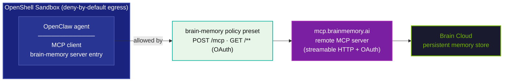

# Brain Memory Integration

This example was built by [Onur Karalı](https://github.com/onurkarali) of [Omelas](https://omelas.tech) and is presented as-is. See credits for contact information.

[Brain Memory](https://github.com/omelas-tech/brain) is a persistent, neuroscience-inspired memory system for AI agents — a single global brain with deterministic recall, spreading activation, spaced reinforcement, and model-driven capture, shared across every agent the user runs. This example shows how to give a NemoClaw-managed OpenClaw agent that same persistent, cross-session memory through the hosted Brain Memory **remote MCP server**, and how to make it work under OpenShell's deny-by-default egress policy.

Because NemoClaw sandboxes block all egress by default, the zero-install remote-MCP path (`openclaw mcp add … --auth oauth`) fails out of the box: both the MCP JSON-RPC calls and the OAuth login flow are denied. The bundled network-policy preset allowlists exactly what the integration needs — nothing more.

## What's Included

| File | Purpose |
|---|---|
| [`policies/brainmemory-policy.yaml`](policies/brainmemory-policy.yaml) | OpenShell network-policy preset allowlisting the Brain Memory remote MCP endpoint (`POST /mcp`) and its OAuth discovery/login flow (`GET`). Includes commented-out optional endpoints for syncing a sandbox-local brain via Brain Cloud or a private git remote. |

## How It Works



The agent's memory lives in Brain Cloud, not in the sandbox — so sandbox recreation costs nothing. The preset opens two things on `mcp.brainmemory.ai:443`:

- `POST /mcp` — MCP JSON-RPC (memory tools, session negotiation)
- `GET /**` — OAuth 2.0 discovery + authorization endpoints used by `openclaw mcp login`

## Prerequisites

- A NemoClaw-managed OpenClaw sandbox ([NVIDIA/NemoClaw](https://github.com/NVIDIA/NemoClaw))
- A [Brain Memory](https://brainmemory.ai) account for the OAuth login
- For the optional memory-slot plugin path only: the `brain` CLI (`npm install -g brain-memory`) and Node.js ≥ 22.19 on the Gateway machine

## Setup

### 1. Apply the egress policy preset

```bash
nemoclaw <sandbox-name> policy-add \
  --from-file examples/brain-memory/policies/brainmemory-policy.yaml --yes
```

To persist the policy across sandbox recreations, merge the `network_policies` entry into your baseline `openclaw-sandbox.yaml` and re-run `nemoclaw onboard`.

### 2. Register the remote MCP server and log in

```bash
openclaw mcp add brain-memory --url https://mcp.brainmemory.ai/mcp --auth oauth
openclaw mcp login brain-memory
```

The login flow completes over the `GET` rules in the preset; memory tool calls go over `POST /mcp`. Optionally set `BRAIN_AGENT=nemoclaw` in the sandbox environment so stored memories record their host agent.

### 3. Optional — deeper integration via the memory-slot plugin

If you run the `brain` CLI on the Gateway, the [`openclaw-brain-memory`](https://www.npmjs.com/package/openclaw-brain-memory) plugin can replace OpenClaw's built-in `memory-core` in the memory slot: `memory_search` runs on the deterministic `brain recall` engine, `brain_memorize` lets the model store classified memories, and a budget-bounded session-start payload (pinned facts + relevant memories + skills index) is injected into the system prompt once per session.

```bash
openclaw plugins install openclaw-brain-memory
```

Then select the memory slot in `~/.openclaw/openclaw.json` and restart the Gateway:

```json
{
  "plugins": {
    "slots": { "memory": "brain-memory" },
    "entries": {
      "brain-memory": {
        "enabled": true,
        "config": { "project": "nemoclaw", "topRecall": 6, "autoReinforce": true }
      }
    }
  }
}
```

See the [full integration guide](https://github.com/omelas-tech/brain/blob/main/integrations/openclaw/README.md) for the plugin configuration reference, a slot-neutral hook pack, and a ClawHub skill.

## Verification

1. `openclaw mcp list` — `brain-memory` should show as registered and authenticated.
2. Ask the agent to remember something ("remember that our staging cluster is eu-west-1"), start a fresh session, and ask it to recall.
3. Watch the OpenShell TUI for interception prompts on first use — if you see egress denials for `mcp.brainmemory.ai`, the preset is not applied to the running sandbox.

## Verification Status

Verified live on 2026-07-04 against NemoClaw v0.0.73 / OpenShell 0.0.71 (docker, default image), sandbox agent OpenClaw v2026.5.27:

| Probe (inside the sandbox) | Result | Proves |
|---|---|---|
| `curl https://mcp.brainmemory.ai/mcp` before `policy-add` | CONNECT tunnel refused (403) | deny-by-default egress |
| same `curl` after `policy-add` | CONNECT tunnel refused (403) | `binaries:` least-privilege enforced — curl is deliberately not allowlisted |
| `node` `fetch()` after `policy-add` | HTTP response received | the policy admits exactly the intended binary to exactly the intended host |

The preset applied cleanly both times it was loaded (`policy-add` → "Policy version N loaded"), including once after a sandbox `rebuild`. The `binaries:` path `/usr/local/bin/node` is confirmed correct for the default docker image (node v22.22.2); other images may differ.

Two honest caveats:

- The in-sandbox **OAuth login flow was not exercised**: NemoClaw v0.0.73 pins OpenClaw v2026.5.27, which predates the `openclaw mcp add/login/probe` CLI (its `mcp set` exists, but there is no login command to complete OAuth). The same connector's OAuth + memory tools are verified end-to-end on a host OpenClaw 2026.6.11 install; once NemoClaw ships an OpenClaw ≥ 2026.6, the documented `mcp add`/`mcp login` flow applies as written.
- A sandbox **`rebuild` resets applied policies** ("Policies: none" afterwards) — re-run `policy-add`, or merge the `network_policies` entry into your baseline `openclaw-sandbox.yaml` as recommended above.

## Durability Note

Treat everything inside the sandbox as disposable. The remote-MCP path stores nothing locally, so nothing is lost on recreation. If you instead run the local `brain` CLI *inside* the sandbox, do not keep the only copy of `~/.brain` there — configure brain sync (Brain Cloud or a private git remote; both support AES-256-GCM encryption) so memories survive recreation. The policy file contains commented-out endpoint entries for both sync paths.

## Troubleshooting

- **Egress denials for `mcp.brainmemory.ai`** — the preset is not applied to the running sandbox; re-run the `policy-add` command and watch the OpenShell TUI for interception prompts. Note that a sandbox `rebuild` resets applied policies — re-apply afterwards.
- **OAuth login never completes** — the `GET /**` rule is required for discovery and authorization; confirm it was not trimmed when merging the preset into a baseline policy. Also check your sandbox's OpenClaw version: `openclaw mcp login` requires OpenClaw ≥ 2026.6 (NemoClaw v0.0.73 ships 2026.5.27).
- **`curl` probes fail even with the preset applied** — expected: the policy's `binaries:` clause allowlists only the OpenClaw Gateway's node (and git); test reachability with `node` `fetch()` instead, or temporarily add your probe binary.
- **Binary denials** — the preset's paths are verified for the default docker image (`/usr/local/bin/node`); adjust them if your sandbox uses a custom image.
- **Plugin path: "brain CLI not found" in the Gateway log** — install it (`npm install -g brain-memory`) or set `plugins.entries.brain-memory.config.brainBin` to its absolute path.

## Credits And Learn More

- Brain Memory: [github.com/omelas-tech/brain](https://github.com/omelas-tech/brain) · [brainmemory.ai](https://brainmemory.ai)
- OpenClaw integration guide (plugin, hooks, skill, MCP): [integrations/openclaw](https://github.com/omelas-tech/brain/blob/main/integrations/openclaw/README.md)
- Author: [Onur Karalı](https://github.com/onurkarali) — [Omelas](https://omelas.tech)

Licensed under Apache 2.0, consistent with this repository's [LICENSE](../../LICENSE).
