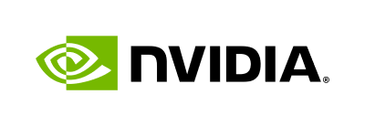

# Telemetry And UI Notes

## How The UI Works

The UI is a host-side app, not a sandbox service.

- `app/ui/` is a Vite/React frontend.
- `app/server/` is a FastAPI backend.
- `scripts/start.sh` builds the frontend and runs Uvicorn on `PORT`, default
  `8765`.
- The backend receives uploads, prepares them on the host, uploads prepared
  assets into the sandbox with `openshell sandbox upload`, and invokes Hermes
  through `openshell sandbox exec`.
- The policy drawer reads and updates the live OpenShell policy to demonstrate
  allow/deny behavior.

This keeps the browser experience easy to test while the agent and model calls
remain inside the OpenShell/NemoClaw sandbox boundary.

## Phoenix And NemoFlow

`extras/docker-compose.yml` provides Phoenix on `http://localhost:6006`.

Start it with:

```bash
bash scripts/00-host-services.sh
```

Then set:

```bash
NEMO_FLOW_PROJECT_NAME=hermes-omni-demo
PHOENIX_COLLECTOR_ENDPOINT=http://172.17.0.1:6006/v1/traces
```

The existing community triage examples can bake NemoFlow instrumentation into a
custom Hermes image. This Omni demo starts from an already-onboarded Hermes
sandbox, so `scripts/setup.sh` writes the same OpenInference metadata into the
mutable Hermes config when `PHOENIX_COLLECTOR_ENDPOINT` is set. Traces only
appear when the running Hermes image includes NemoFlow/OpenInference
instrumentation.

Phoenix groups OpenInference traces by the `openinference.project.name`
resource attribute. This demo sets that attribute from `NEMO_FLOW_PROJECT_NAME`
so traces land under `hermes-omni-demo` instead of Phoenix's `default` project.
