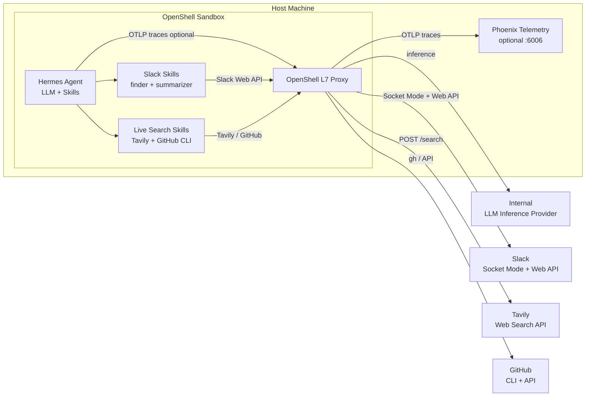

# personal-community-sentiment-triage-simplified: Hermes + Slack + Live Search

A personal Hermes agent that helps track what the developer community is
working on, struggling with, asking about, and flagging as gaps. You interact
with it through Slack. It researches live sources through Tavily web search
and the GitHub CLI instead of maintaining a host-side ETL mirror.

## Architecture



**Key invariants:**

- Slack is the required interaction channel.
- GitHub and forum/community research is live.
- Tavily handles web and NVIDIA forum discovery.
- GitHub CLI handles live GitHub issue and pull-request research.
- Phoenix telemetry is optional; no host database or ETL stack is required.

## Agent Skills

Skills live in [agents/hermes/skills/](agents/hermes/skills/).

| Skill | Purpose |
|-------|---------|
| `slack-channel-finder` | Discover Slack channels by topic, team, or domain. |
| `slack-channel-summarizer` | Resolve a Slack channel and read message history. |
| `tavily-web-search` | Search the live web, including NVIDIA forum pages and docs, through Tavily. |
| `github-cli-search` | Search live GitHub issues and pull requests with `gh`. |
| `cross-source-gap-analysis` | Synthesize Slack, Tavily, and GitHub CLI findings into gaps and follow-ups. |

## Quickstart

### 1. Install prerequisites

```console
$ git clone https://github.com/NVIDIA/nemoclaw-community.git
$ cd nemoclaw-community/examples/personal-community-sentiment-triage-simplified
$ curl -LsSf https://raw.githubusercontent.com/NVIDIA/OpenShell/main/install.sh | OPENSHELL_VERSION=v0.0.36 bash
```

You also need a running Docker daemon.

### 2. Configure credentials

```console
$ cp .env.example .env
```

Fill in:

- `COMPATIBLE_API_KEY` for the inference provider.
- `SLACK_BOT_TOKEN`, `SLACK_APP_TOKEN`, and optionally `SLACK_ALLOWED_IDS`; see [docs/set-up-slack.md](docs/set-up-slack.md).
- `TAVILY_API_KEY` for live web/forum search.
- `GITHUB_TOKEN` for live GitHub CLI search.

### 3. Optional telemetry

Phoenix is optional. Start it only if you want traces:

```console
$ bash scripts/00-host-services.sh
```

Then set:

```bash
PHOENIX_COLLECTOR_ENDPOINT=http://172.17.0.1:6006/v1/traces
```

### 4. Bring up the agent

```console
$ bash scripts/bring-up.sh
```

This runs:

- `01-gateway.sh` — ensures an OpenShell gateway is active.
- `02-providers.sh` — upserts inference, Slack, Tavily, and optional GitHub providers.
- `03-sandbox.sh` — builds and launches the Hermes sandbox and reapplies policy.

## What This Example Owns

- `agents/hermes/` — Hermes sandbox image, startup script, plugin, SOUL, and skills.
- `policy.yaml` — OpenShell filesystem/process/network policy for inference, Slack, Tavily, GitHub, and optional Phoenix.
- `scripts/` — gateway/provider/sandbox lifecycle scripts, teardown, snapshot, restore, and optional TLS proxy.
- `extras/docker-compose.yml` — optional Phoenix telemetry only.
- `.env.example` — local credential template.

## Configuration

| Var | Required | What it does |
|---|---:|---|
| `COMPATIBLE_API_KEY` or `OPENAI_API_KEY` | Yes | Inference API key. |
| `NEMOCLAW_ENDPOINT_URL` | Yes | OpenAI-compatible inference base URL. |
| `NEMOCLAW_MODEL` | Yes | Model passed to OpenShell inference. |
| `SLACK_BOT_TOKEN` | Yes | Slack bot token (`xoxb-`). |
| `SLACK_APP_TOKEN` | Yes | Slack app-level Socket Mode token (`xapp-`). |
| `SLACK_ALLOWED_IDS` | Recommended | Comma-separated Slack user IDs allowed to interact. |
| `TAVILY_API_KEY` | Yes | Tavily search API key. |
| `GITHUB_TOKEN` | Yes | Authenticates `gh` for live GitHub search. |
| `PHOENIX_COLLECTOR_ENDPOINT` | No | Enables optional NeMo-Flow/OpenInference telemetry. |
| `SANDBOX_NAME` | No | Sandbox name, default `hermes-direct`. |
| `OPENSHELL_GATEWAY` | No | Gateway name, default `examples-gateway`. |
| `OPENSHELL_GATEWAY_PORT` | No | Gateway port, default `8090`. |

## Verification

```console
$ openshell sandbox list                      # hermes-direct should be ready
$ openshell sandbox exec --name hermes-direct -- \
    curl -sf http://localhost:8642/health     # {"status":"ok",...}
$ openshell provider list | grep hermes-direct
```

Inside Slack, send the bot a DM from an allowlisted account. It should respond
within a few seconds.

To smoke-test the live research skills inside the sandbox:

```console
$ openshell sandbox exec --name hermes-direct -- \
    /usr/bin/python3 /sandbox/.hermes-data/skills/tavily-web-search/scripts/tavily_search.py \
      --query "NemoClaw GitHub issue forum" --max-results 3

$ openshell sandbox exec --name hermes-direct -- \
    /usr/bin/python3 /sandbox/.hermes-data/skills/github-cli-search/scripts/gh_search.py \
      search --query "repo:NVIDIA/NemoClaw is:issue" --limit 3
```

## Tear Down

```console
$ bash scripts/tear-down.sh
```

This removes the sandbox and per-sandbox providers. Optional Phoenix keeps
running unless you pass:

```console
$ bash scripts/tear-down.sh --stop-host-services
```

Manual cleanup for less-common operations:

- `openshell gateway destroy --name examples-gateway` — destroy the gateway.
- `openshell provider delete compatible-endpoint` — remove the shared inference provider.

## Persistence

What survives a normal `tear-down.sh && bring-up.sh` cycle:

- OpenShell providers and gateway state unless explicitly deleted.
- Optional Phoenix container state for the running compose stack.

What does not survive by default:

- Hermes runtime state under `/sandbox/.hermes-data/`.

Use [scripts/snapshot.sh](scripts/snapshot.sh) and [scripts/restore.sh](scripts/restore.sh)
to preserve Hermes state across sandbox recreation:

```console
$ bash scripts/snapshot.sh
$ bash scripts/tear-down.sh
$ bash scripts/bring-up.sh
$ bash scripts/restore.sh
```
