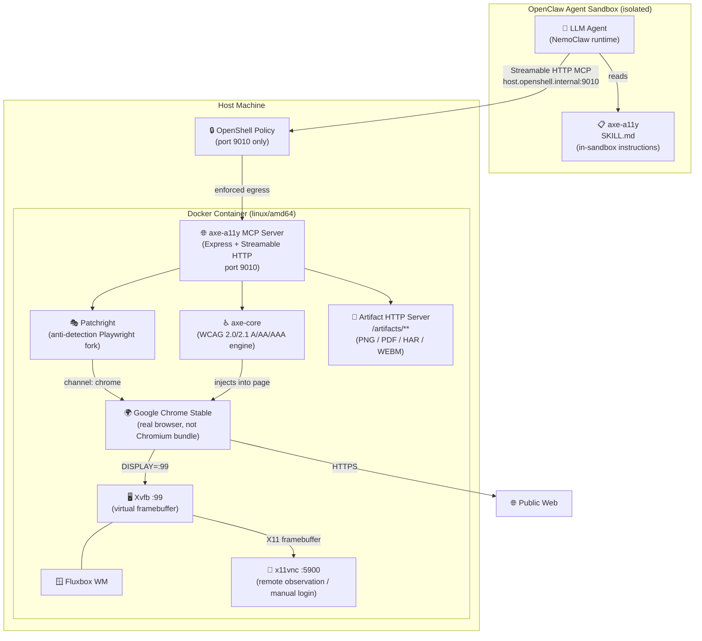
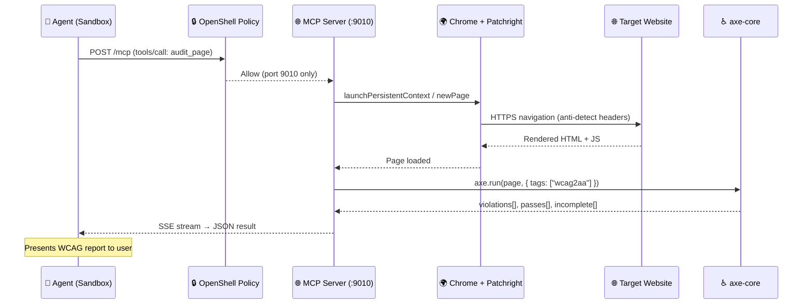
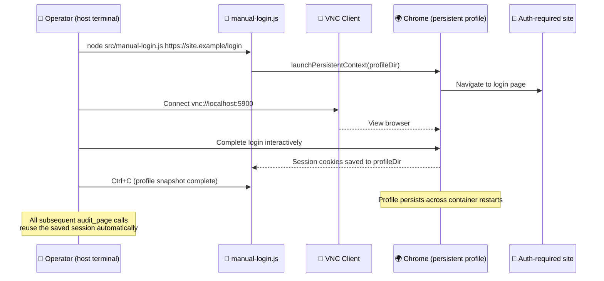
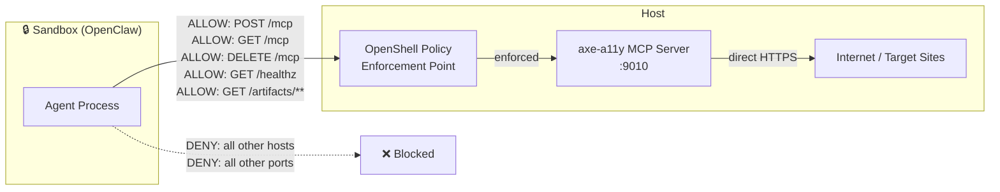
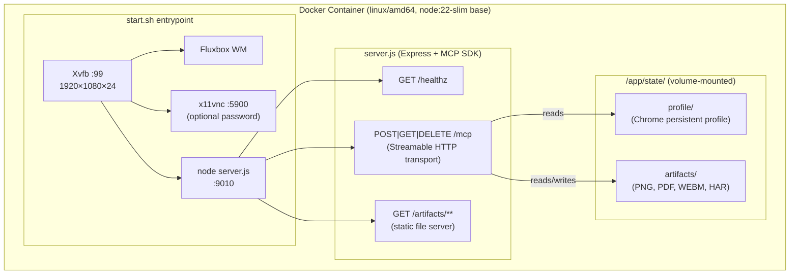

<!-- SPDX-FileCopyrightText: Copyright (c) 2026 NVIDIA CORPORATION & AFFILIATES. All rights reserved. -->
<!-- SPDX-License-Identifier: Apache-2.0 -->

# Axe A11y Browser Auditor

Audits web pages for accessibility and captures screenshots, PDFs, and network traces.

| Catalog field | Value |
| --- | --- |
| Industry | 🌐 Consumer Internet |
| Requirements | Docker 24+ with Compose · linux/amd64 or Docker Desktop emulation · dedicated OpenShell/NemoClaw sandbox |

Axe A11y Browser Auditor is a community recipe for automated web quality and WCAG accessibility compliance testing inside a NemoClaw-managed sandbox. It installs an `axe-a11y` skill into an existing OpenClaw sandbox, then routes requests to a host-side Streamable-HTTP MCP sidecar running `axe-core` and Patchright against real Google Chrome Stable.

This example is based on the public proposal in issue `#109`. It is an independent community contribution, not a supported part of NemoClaw core.

---

## Design

### Motivation

Standard accessibility testing tools run inside CI or developer machines with unrestricted network access. Integrating them with an agentic sandbox requires:

1. **Isolation**: The sandbox cannot spawn arbitrary processes or open raw sockets; all browser automation must happen outside it.
2. **Anti-detection**: Common headless Chromium is fingerprinted and blocked by bot-walls (Cloudflare, Akamai, DataDome). Real Chrome with patched CDP signals is required.
3. **Authentication**: Many sites require login. Cookie/session state must persist across audit runs without re-login.
4. **Bounded egress**: The sandbox policy must allow the agent to call the MCP server but nothing else — no raw internet access, no lateral movement.

This recipe addresses all four by running a sidecar process on the host, exposing only a narrow MCP endpoint, and limiting the sandbox policy to that single host port.

---

### 3-Layer Architecture



---

### Request Lifecycle



---

### Authenticated Audit Flow



---

### Security Boundary



**What the sandbox can do:**
- Call MCP tools via `POST /mcp`
- Download generated artifacts via `GET /artifacts/**`
- Health-check the service via `GET /healthz`

**What the sandbox cannot do:**
- Connect directly to any website (all outbound internet is denied)
- Reach any port other than 9010
- Spawn processes or access the host filesystem

---

### Tool Reference

| Tool | Purpose | Key Inputs | Key Outputs |
|---|---|---|---|
| `audit_page` | Full WCAG audit | `url`, `tags`, `include_passes` | `violations[]`, `passes[]`, `incomplete[]` with WCAG metadata |
| `check_specific_rules` | Targeted rule check | `url`, `rules[]` | Per-rule results with node-level detail |
| `audit_element` | Single component audit | `url`, `selector` | Element-scoped violations |
| `get_wcag_summary` | Pass/fail summary | `url` | Summary by WCAG level (A/AA/AAA) and severity |
| `axe_capture_page` | Full-page screenshot | `url`, `full_page`, `wait_for_selector` | `screenshot_artifact_url` (PNG) |
| `axe_capture_element` | Element screenshot | `url`, `selector` | `screenshot_artifact_url` (PNG) |
| `record_page_session` | Video recording | `url`, `duration_ms` | `recording_artifact_url` (WEBM) |
| `generate_pdf` | PDF export | `url`, `format`, `landscape` | `pdf_artifact_url` (PDF) |
| `capture_network` | Network trace | `url`, `export_format` | HAR or JSON summary of all requests |

---

### Container Internals



---

## Scope

This recipe stands up the host-side `axe-a11y` MCP server sidecar, installs the in-sandbox `axe-a11y` skill, and applies a narrow policy that lets a dedicated sandbox reach only that server on `host.openshell.internal:9010`.

It provides 9 automated tools for web quality auditing — see the [Tool Reference](#tool-reference) table above.

## Provenance And Intended Users

- **Provenance**: Independent community contribution proposed in public issue `#109`.
- **Intended users**: QA engineers, web developers, and security/compliance operators running NemoClaw or OpenShell who need automated WCAG and web quality auditing.
- **Support boundary**: This repository example documents one public integration pattern; operators remain responsible for container runtime setup and network policy compliance.

## Requirements

- Docker with Compose support (Docker 24+)
- `linux/amd64` host or Docker Desktop with emulation enabled
- Python 3.10+ (for repository validation checks)
- One working OpenShell or NemoClaw host with a dedicated sandbox

## Credentials And Secret Handling

Copy `.env.example` to `.env` before live deployment:

```bash
cp .env.example .env
```

Configuration parameters:

| Variable | Default | Purpose |
|---|---|---|
| `AXE_A11Y_SERVICE_PORT` | `9010` | MCP server HTTP port |
| `AXE_A11Y_VNC_PORT` | `5900` | VNC remote view port |
| `AXE_A11Y_VNC_ENABLED` | `false` | Enable VNC |
| `AXE_A11Y_VNC_PASSWORD` | _(empty)_ | Required VNC password if VNC is enabled |
| `AXE_A11Y_PROFILE_ENABLED` | `false` | Enable persistent Chrome profile |
| `AXE_A11Y_SERVICE_HEADLESS` | `true` | Run Chrome in headless mode |

> [!CAUTION]
> Do not commit `.env`, `state/`, or generated screenshot/PDF artifacts. The `state/profile/` directory may contain unencrypted session cookies.

## Quickstart

```bash
git clone https://github.com/NVIDIA/nemoclaw-community.git
cd nemoclaw-community/examples/recipes/community/axe-a11y-browser-auditor

# 1. Start the host-side sidecar
cp .env.example .env
./scripts/bring-up.sh

# 2. Verify sidecar health
./scripts/verify.sh

# 3. Install the skill into the running sandbox
SANDBOX_NAME="<your-sandbox-name>"
openshell sandbox exec --name "$SANDBOX_NAME" -- \
  mkdir -p /sandbox/.openclaw/skills/axe-a11y
openshell sandbox upload "$SANDBOX_NAME" src/SKILL.md \
  /sandbox/.openclaw/skills/axe-a11y/SKILL.md

# 4. Apply the network policy
openshell policy set --policy policy.yaml --wait "$SANDBOX_NAME"

# 5. Register the MCP server in the sandbox agent configuration
openshell sandbox exec --name "$SANDBOX_NAME" -- \
  openclaw mcp add axe-a11y --url "http://host.openshell.internal:9010/mcp" --transport streamable-http

# 6. Verify MCP connectivity and tool discovery from inside the sandbox
openshell sandbox exec --name "$SANDBOX_NAME" -- \
  openclaw mcp probe axe-a11y
```

## Directory Structure

```text
axe-a11y-browser-auditor/
├── README.md                      # Recipe documentation (this file)
├── .env.example                   # Environment configuration template
├── .gitignore                     # Excludes .env, state/, node_modules/
├── docker-compose.yml             # Sidecar container orchestration
├── policy.yaml                    # OpenShell security policy (YAML)
├── policies/
│   └── default-policy.json        # Bounded egress policy (JSON)
├── scripts/
│   ├── bring-up.sh                # Build + start sidecar + health poll
│   ├── teardown.sh                # docker compose down -v
│   └── verify.sh                  # Health + MCP tools/list check
└── src/
    ├── SKILL.md                   # In-sandbox agent skill instructions
    ├── Dockerfile                 # node:22-slim + Chrome + VNC stack
    ├── package.json               # Node.js dependencies
    ├── server.js                  # Express + MCP Streamable HTTP server
    ├── start.sh                   # Container init (Xvfb → VNC → Node)
    └── manual-login.js            # One-time VNC interactive login helper
```

## Network And Policy

The recipe bounds sandbox egress strictly to the MCP server on port 9010 via `policy.yaml`:

| Route | Method | Purpose |
|---|---|---|
| `/healthz` | GET | Liveness check |
| `/mcp` | POST | Send MCP tool call (new session or existing) |
| `/mcp` | GET | Resume SSE stream for in-flight call |
| `/mcp` | DELETE | Terminate MCP session |
| `/artifacts/**` | GET | Download generated PNG / PDF / WEBM / HAR |

All other outbound traffic from the sandbox is denied.

## Authenticated Audits (Optional)

For sites behind login, run the one-time interactive setup:

```bash
# 1. Enable persistent profile and VNC in .env
cat >> .env <<'EOF'
AXE_A11Y_PROFILE_ENABLED=true
AXE_A11Y_VNC_ENABLED=true
AXE_A11Y_VNC_PASSWORD=changeme
EOF

# 2. Restart with profile + VNC enabled
./scripts/teardown.sh && ./scripts/bring-up.sh

# 3. Exec into container and start manual-login helper
docker exec -it axe-a11y-mcp-server \
  node /app/manual-login.js https://yoursite.example/login

# 4. Connect via VNC and complete login
#    (uses the configured port from AXE_A11Y_VNC_PORT, default 5900)
open vnc://localhost:${AXE_A11Y_VNC_PORT:-5900}

# 5. Press Ctrl+C in step 3 once login is complete
# Profile is now saved and all subsequent audits reuse it automatically

# 6. (Recommended) Disable VNC after login for security
sed -i '' '/AXE_A11Y_VNC_ENABLED/d; /AXE_A11Y_VNC_PASSWORD/d' .env
./scripts/teardown.sh && ./scripts/bring-up.sh
```

## Verification

```bash
./scripts/verify.sh
```

The script checks:
1. `GET /healthz` returns `{"status":"ok",...}`
2. `POST /mcp` with `tools/list` returns all 9 tool names

## Teardown

```bash
./scripts/teardown.sh
```

Stops the container, removes volumes, and removes the Docker network. Note that the persistent `state/` directory is kept by default.

If you want to completely purge the persistent state and saved artifacts, run:

```bash
./scripts/teardown.sh --purge
```

## Known Limitations

- The container runs as `linux/amd64`. Apple Silicon (M-series) hosts require Docker Desktop with Rosetta emulation — performance may be reduced.
- High-resolution video recording (`record_page_session`) requires at least 2 GB of container memory.
- `state/profile/` stores Chrome session cookies unencrypted. Use a dedicated, low-privilege browser account.

## Third-Party Dependencies

| Package | License | Purpose |
|---|---|---|
| `@axe-core/playwright` | MPL-2.0 | WCAG rule engine injected into Chrome pages |
| `patchright` | Apache-2.0 | Anti-detection Playwright fork for real Chrome |
| `@modelcontextprotocol/sdk` | MIT | MCP Streamable HTTP server transport |
| `express` | MIT | HTTP routing and static artifact serving |
