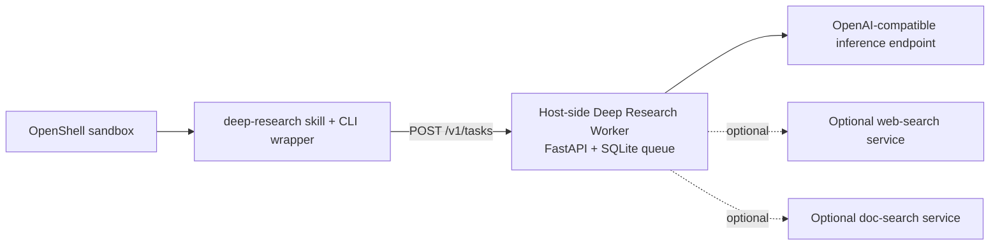

<!-- SPDX-FileCopyrightText: Copyright (c) 2026 NVIDIA CORPORATION & AFFILIATES. All rights reserved. -->
<!-- SPDX-License-Identifier: Apache-2.0 -->

# Deep Research Worker

Deep Research Worker is a community recipe for asynchronous, long-horizon
research with a NemoClaw-managed sandbox. It installs a `deep-research` skill
and CLI wrapper into one existing sandbox, then routes requests from that
sandbox to a host-side FastAPI worker that runs a LangChain DeepAgents graph,
stores task state in SQLite, and can call bounded read-only host-side services.

This example is based on the public proposal in issue `#110`. It is an
independent community contribution, not a supported part of NemoClaw core. Its
catalog placement supports discovery only; it does not imply NVIDIA support or
a support or readiness guarantee.

## Scope

This recipe stands up the host-side research worker, installs the in-sandbox
skill and CLI wrapper, and adds or applies a narrow policy that lets a
dedicated sandbox reach only that worker on `host.openshell.internal:9050`.

It does not:

- create a sandbox for you
- provision an inference provider
- stand up web-search or doc-search helper services
- start a dashboard or a general-purpose OpenClaw agent runtime
- manage unrelated routes on a shared sandbox safely

Use a dedicated sandbox for this recipe. The worker can call helper services on
the same host when you configure their endpoints.

## Provenance And Intended Users

- Provenance: independent community contribution proposed in public issue `#110`
- Intended users: operators who already run NemoClaw or OpenShell and want to
  add a background research workflow to one sandbox
- Support boundary: this repository example documents one public integration
  pattern; operators remain responsible for provider credentials, host service
  availability, and any production hardening

## Requirements

- Docker with Compose support
- Python 3.10 or newer for local syntax checks
- One working OpenShell or NemoClaw host with a dedicated sandbox for this recipe
- One OpenAI-compatible inference endpoint reachable from the worker container

Optional host-side services:

- web search on `WEBSEARCH_ENDPOINT_URL`
- document search on `DOC_SEARCH_ENDPOINT_URL`

This recipe does not expose arbitrary MCP, email, write, publish, or other
action tools. Its agent toolset is limited to the built-in read-only web-search
and document-search adapters.

## Credentials And Secret Handling

Copy `.env.example` to `.env` and replace placeholder values before live use.

Required values:

- `OPENAI_API_KEY`
- any non-default endpoint overrides your host requires

The worker API always requires `DEEPAGENTS_SERVICE_SECRET`. Leave it empty in
`.env` to let `scripts/bring-up.sh` generate a strong value in the gitignored
`.run/worker-token` file. The script installs the same token as a mode-`0600`
credential file for the authorized sandbox client. It does not place the token
in the wrapper, source tree, command output, or logs.

Do not commit `.env`, generated state, or sandbox-local token material. The
local `.gitignore` excludes `.env`, `state/`, and `.run/`.

## Quickstart

```bash
git clone https://github.com/NVIDIA/nemoclaw-community.git
cd nemoclaw-community/examples/recipes/community/deep-research-worker

cp .env.example .env
bash scripts/bring-up.sh
```

Queue a task from inside the target sandbox:

```bash
openshell sandbox exec --name deep-research-worker -- \
  /sandbox/bin/deep-research --depth deep \
  "Compare public agent sandboxing patterns for long-running research workflows"
```

Stop the worker and remove the installed skill assets:

```bash
bash scripts/teardown.sh
```

## Architecture



Three boundaries matter:

1. The sandbox can reach only the worker API, not the helper services directly.
2. The worker keeps its task queue and retry state on the host in SQLite.
3. The worker exposes only its built-in read-only web-search and document-search
   adapters; arbitrary MCP tools are not supported by this recipe.
4. Each task runs in a dedicated process group that the parent fully stops
   before a cancellation or timeout changes task state.

## Files

| Path | Purpose |
| --- | --- |
| `docker-compose.yml` | Runs the host-side worker container |
| `policies/deep-research-worker.yaml` | Narrow sandbox egress policy for the worker API |
| `scripts/bring-up.sh` | Starts the worker, applies the policy, installs the skill and CLI wrapper |
| `scripts/verify.sh` | Teardown-safe local checks for shell syntax, Python syntax, Compose rendering, and skill metadata |
| `scripts/teardown.sh` | Stops the worker and removes the installed skill assets |
| `src/` | Worker service, task store, client, and container build files |

## Setup And Configuration

`scripts/bring-up.sh` does four things:

1. Loads `.env` when present.
2. Starts or rebuilds the worker with Docker Compose.
3. Waits for `GET /healthz` on the worker.
4. If `openshell` and the named sandbox exist, installs the policy and then installs:
   - `SKILL.md` into `/sandbox/.openclaw/skills/deep-research/`
   - `deep_research_client.py` into the same skill directory
   - a mode-`0600` worker credential into the same skill directory
   - `/sandbox/bin/deep-research` as the user-facing wrapper

Policy behavior:

- If `nemoclaw` is available, the script adds the recipe policy additively with
  `policy-add --from-file`.
- If only `openshell` is available, the script refuses to replace the full
  sandbox policy unless you set `DEEP_RESEARCH_ALLOW_POLICY_REPLACE=1` for a
  dedicated sandbox.

The script does not create a sandbox. If the sandbox is missing, it leaves the
host-side worker running and prints the follow-up action.

## Network And Policy Permissions

The sandbox policy is intentionally narrow. It allows only:

- `host.openshell.internal:9050`
- REST methods `GET`, `POST`, and `DELETE`
- binaries that invoke the wrapper or Python client

The sandbox does not receive direct routes to host-side web search, doc search,
or other helper services. Only the worker container can call configured
read-only services.

The host port binds to the `openshell-docker` bridge address when that network
is available and otherwise binds to `127.0.0.1`. It is never intentionally
published on every host interface.

Inside the worker container, helper-service defaults use
`host.docker.internal`. The Compose file adds an explicit host-gateway mapping
so Linux Docker hosts can resolve that name too.

The protected credential file authorizes the selected sandbox to call the
worker. Code running as that sandbox user can use the credential, so install
this recipe only into a dedicated sandbox whose policy and workloads you trust.

## Execution And Recovery

The queue uses these lifecycle rules:

- Each claimed task runs in an isolated child process.
- Cancellation, timeout, shutdown, and task completion terminate the entire
  process group, including descendants, before the task changes state.
- On service restart, abandoned `running` tasks become failed and abandoned
  `cancelling` tasks become cancelled. They are not replayed automatically.
- Retention cleanup removes only expired terminal tasks.

## Verification

Run the documented lightweight checks from this example directory:

```bash
bash scripts/verify.sh
```

The script is teardown-safe. It does not start external services or contact the
inference provider. It validates:

- shell syntax for `scripts/*.sh`
- Python syntax for `src/*.py`
- behavioral tests for authentication, rubric revision, tool filtering,
  cancellation, timeout, restart recovery, and retention cleanup
- Docker Compose rendering
- skill frontmatter presence
- policy file shape

Expected result:

```text
PASS: deep-research-worker local verification
```

## Known Limitations

- The included verification does not contact the configured inference endpoint
  or prove that helper services and sandbox policy work live.
- The worker depends on third-party packages and live host-side services. The
  DeepAgents version is pinned for the tested rubric API, but the example does
  not include a complete transitive lockfile.
- The default client and worker timeouts are tuned for long-running research,
  not low-latency chat turns.
- Operators who use `openshell policy set` without a dedicated sandbox can
  replace unrelated policy rules; the script blocks that path unless
  `DEEP_RESEARCH_ALLOW_POLICY_REPLACE=1` is set explicitly.

## Third-Party Dependencies And License Notes

The worker container installs Python packages listed in `src/requirements.txt`
and uses the `python:3.11-slim` base image. The repository-level
`THIRD-PARTY-NOTICES` file records the expected notice inventory for those
components. Review the terms of any external search or inference service before
production use.
