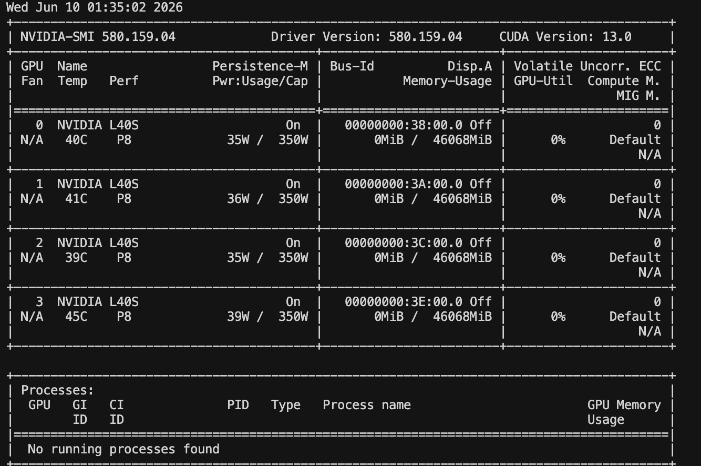
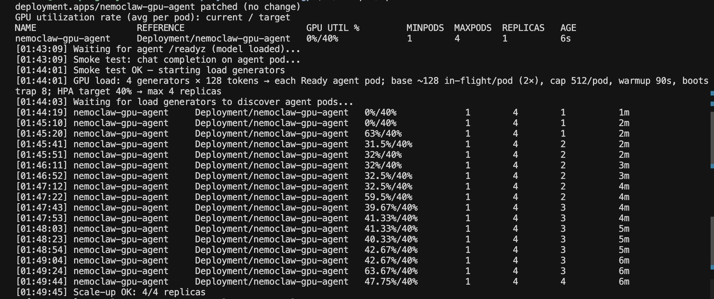
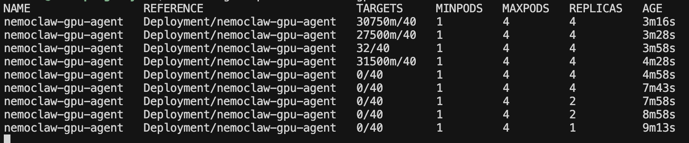

<!--
  SPDX-FileCopyrightText: Copyright (c) 2026 NVIDIA CORPORATION & AFFILIATES. All rights reserved.
  SPDX-License-Identifier: Apache-2.0
-->

# NemoClaw Kubernetes GPU autoscaling

Experimental community recipe: a CPU-only NemoClaw/OpenClaw sandbox (OpenShell) sends inference to authenticated Ollama pods in the same cluster. An HPA scales only those Ollama pods on per-pod GPU utilization. Unsupported / non-production.

Source baseline: [NVIDIA/NemoClaw#7459](https://github.com/NVIDIA/NemoClaw/pull/7459) at commit [`77334cc`](https://github.com/NVIDIA/NemoClaw/commit/77334ccbbadba2c5079fe9e99fe80a3cddc846b5) (`deploy/helm/gpu_autoscaling_k8s/`).

**Envoy Gateway is optional.** When enabled (default), Envoy sits in front of the GPU replicas and load-balances with **LeastRequest**: each new request is sent to a Ready backend that currently has the fewest outstanding requests, so busy GPUs get less new traffic than idle ones. Skip Envoy when the agent ClusterIP Service is enough (round-robin / kube-proxy only — no LeastRequest):

| Choice | Install command |
|--------|-----------------|
| With Envoy LeastRequest (default) | `./scripts/install-hpa.sh` |
| Without Envoy (agent Service only) | `ENABLE_ENVOY_LB=0 ./scripts/install-hpa.sh` |

**New here?** Start with [Quick start](#quick-start). Teardown: [Uninstall](#uninstall).

Pins in `versions.env` (keep them; do not float to `latest`): NemoClaw `v0.0.104`, OpenShell `0.0.85`, Agent Sandbox `v0.5.0`. Treat that file as one compatibility contract — NemoClaw’s blueprint only accepts a specific OpenShell range, and OpenShell’s K8s path pins Agent Sandbox. When upstream NemoClaw moves on: bump all three together in `versions.env`, rebuild/push a new sandbox image tag, re-apply Agent Sandbox if needed, reinstall/restart OpenShell, recreate the sandbox, then re-run verify + HPA checks to `MAX_REPLICAS` (allocatable GPUs).

## Architecture

```text
OpenShell CLI → port-forward → OpenShell gateway → CPU-only NemoClaw sandbox
```

Runtime inference path (HPA scales to **N** Ollama pods, 1 GPU each). Envoy is optional: LeastRequest when enabled; agent ClusterIP Service when `ENABLE_ENVOY_LB=0`. Set `MAX_REPLICAS` / `TARGET_PODS` from allocatable GPUs — not fixed to 4.

```text
OpenShell CPU sandbox
        ↓
Envoy Gateway — LeastRequest  (or agent Service when ENABLE_ENVOY_LB=0)
        ↓
Authenticated inference endpoints
├─ Ollama pod → GPU 1
├─ Ollama pod → GPU 2
├─ …
└─ Ollama pod → GPU N
        ↑
HPA (example: GPU utilization)
```

**Inference API key.** Chart-generated local Secret for Bearer auth on `/v1/models` and chat completions; users do not supply a cloud key. OpenShell injects it for the sandbox — not for Ollama model pulls, and not OpenAI/`NVIDIA_API_KEY`.

**Kubernetes HPA metrics.** This recipe validates scale-out on GPU utilization (`DCGM_FI_DEV_GPU_UTIL` → Prometheus → Adapter `gpu_utilization_percent` → HPA). Alternate HPA signals (latency, request rate) are deferred to a follow-up PR.

| Default | Value |
|---------|-------|
| Namespace / release | `nemoclaw-gpu` |
| Service port | `8081` |
| Model | `llama3.2:3b` (Ollama example — [Inference models](#inference-models)) |
| GPUs per pod / min–max replicas | `1` / `1`–`N` (allocatable GPUs) |
| HPA target (GPU util example) | `40%` |
| Ingress host (example) | `nemoclaw.local` |

### Validated hardware

Live-tested on [**Brev: AWS Instance**](https://brev.nvidia.com) with a single-node **MicroK8s** cluster:

| Item | Value |
|------|-------|
| Platform | [Brev: AWS Instance](https://brev.nvidia.com) |
| GPUs | **4× NVIDIA L40S** (48 GB GDDR6 each) |
| Scheduling | One node; one Ollama pod per GPU (`MAX_REPLICAS` / `TARGET_PODS` = allocatable **N**) |
| Model used in validation | `llama3.2:3b` |
| Sandbox image registry | MicroK8s local registry `localhost:32000` (also any registry nodes can pull) |



**4× L40S is an example layout**, not a hard limit. Set `MAX_REPLICAS` / `TARGET_PODS` to your allocatable GPU count (**N** — any number you have); install and load-test default to that N. Covered on the example hardware: chart deploy, optional Envoy LeastRequest, authenticated inference, Kubernetes HPA scale-up/down on GPU utilization, Envoy distribution across Ready GPU pods, and OpenShell sandbox → `https://inference.local/v1`.

**Boundaries (short):** namespaces `nemoclaw-gpu` and `nemoclaw-sandboxes`; only Ollama pods request GPUs; Envoy dataplane must stay **ClusterIP** while the OpenShell cleartext HTTP listener exists (`NodePort`/`LoadBalancer` rejected); chart creates **no NetworkPolicy**; installer may touch shared Prometheus, Adapter, Envoy, DCGM ServiceMonitor, MicroK8s add-ons.

## Prerequisites

- Kubernetes 1.25+ with `kubectl` (1.28+ preferred with Envoy / Gateway API)
- Helm 3
- Allocatable `nvidia.com/gpu`; nodes labeled `nvidia.com/gpu.present=true`
- NVIDIA GPU Operator + DCGM Exporter (MicroK8s: `install-hpa.sh` can `microk8s enable gpu`)
- Metrics Server (MicroK8s: installer can enable)
- OpenShell path only: Docker Buildx + a registry nodes can pull (MicroK8s: [local registry](#microk8s-local-registry) on `:32000`); OpenShell CLI matching `versions.env`; Agent Sandbox CRDs (apply the pinned manifest yourself); OIDC **or** the unauthenticated eval exception

```bash
kubectl get nodes \
  -o jsonpath='{range .items[*]}{.metadata.name}{" GPUs="}{.status.allocatable.nvidia\.com/gpu}{"\n"}{end}'
kubectl get nodes -l nvidia.com/gpu.present=true
kubectl get pods -n gpu-operator-resources -l app=nvidia-dcgm-exporter
```

Do not paste kubeconfig, registry credentials, OIDC secrets, or inference API keys into issues or PRs.

## Quick start

From an empty clone to a working sandbox. Run from `examples/recipes/nvidia/kubernetes-gpu-autoscaling/` unless noted. Deeper options: [Install details](#install-details), [OpenShell details](#openshell-details).

### 1. Clone and tools

```bash
git clone https://github.com/NVIDIA/nemoclaw-community.git
cd nemoclaw-community/examples/recipes/nvidia/kubernetes-gpu-autoscaling
source versions.env
uv tool install "openshell==${OPENSHELL_VERSION}"
openshell --version
```

### 2. Confirm GPUs and DCGM

```bash
kubectl get nodes \
  -o jsonpath='{range .items[*]}{.metadata.name}{" GPUs="}{.status.allocatable.nvidia\.com/gpu}{"\n"}{end}'
kubectl get pods -n gpu-operator-resources -l app=nvidia-dcgm-exporter
```

### 3. Install GPU inference + Kubernetes HPA

TLS is required by default when Envoy is on (see [Install details](#install-details)). Isolated eval only: `ALLOW_INSECURE_HTTP=1`.

```bash
export HPA_VALUES=/path/to/hpa-tls-values.yaml
export INGRESS_HOST=nemoclaw.example.com
# Optional: export NEMOCLAW_TARGET_NODE=<gpu-node-name>
# Optional: export INFERENCE_MODEL=<ollama-tag>  # default llama3.2:3b
# MAX_REPLICAS defaults to allocatable GPU count N — do not stage at 2.
./scripts/install-hpa.sh
# Or without Envoy: ENABLE_ENVOY_LB=0 ./scripts/install-hpa.sh
```

Wait for the first Ollama model pull (`ROLLOUT_TIMEOUT` if needed). Then:

```bash
kubectl get pods,service,hpa -n nemoclaw-gpu
./scripts/get-hpa.sh -n nemoclaw-gpu
```

Optional example test: [Example test](#example-test).

### 4. Agent Sandbox, image, OpenShell

```bash
source versions.env
kubectl apply -f \
  "https://github.com/kubernetes-sigs/agent-sandbox/releases/download/${AGENT_SANDBOX_VERSION}/manifest.yaml"

# MicroK8s local registry (validated path) — see [MicroK8s local registry](#microk8s-local-registry)
microk8s enable registry   # if not already on
export NEMOCLAW_SANDBOX_IMAGE=localhost:32000/nemoclaw-k8s:${NEMOCLAW_VERSION}
# Or any registry nodes can pull: export NEMOCLAW_SANDBOX_IMAGE=registry.example.com/team/nemoclaw-k8s:v0.0.104
./scripts/build-nemoclaw-sandbox-image.sh

export OPENSHELL_OIDC_ISSUER=https://idp.example.com/realms/openshell
export OPENSHELL_OIDC_AUDIENCE=openshell-cli
./scripts/install-openshell-k8s.sh
```

Dedicated eval without OIDC: `ALLOW_UNAUTHENTICATED_OPENSHELL=1` plus `OPENSHELL_UNAUTHENTICATED_ACK=dedicated-cluster-port-forward-only`.

### 5. Connect CLI and create sandbox

Terminal 1 — keep running:

```bash
kubectl -n nemoclaw-sandboxes port-forward service/openshell 8080:8080
```

Terminal 2 — client TLS + gateway (OIDC flags in [OpenShell details](#openshell-details)), then:

```bash
export NEMOCLAW_SANDBOX_IMAGE=localhost:32000/nemoclaw-k8s:${NEMOCLAW_VERSION}
export INFERENCE_MODEL=llama3.2:3b   # must match the GPU chart model
./scripts/create-nemoclaw-sandbox.sh
./scripts/verify-nemoclaw-sandbox.sh   # example: "What is NVIDIA NemoClaw?" — see [Example test](#example-test)
./scripts/run-nemoclaw-sandbox.sh   # keep in foreground
```

Users do not paste an inference API key; the chart generates it and OpenShell injects Bearer auth.

### 6. HPA and Envoy check

Scales to **all** allocatable GPUs (`TARGET_PODS` / `SCALE_UP_TARGET` default to **N**), then back to 1. When Envoy is enabled, the script also checks that LeastRequest spreads chat traffic across Ready replicas:

```bash
./scripts/hpa-load-test.sh
# Same ceiling as install: MAX_REPLICAS / TARGET_PODS = N
```

While it runs, watch balance in Grafana ([Grafana: watch workload balancing](#grafana-watch-workload-balancing)). The load-test script remains the pass/fail check.

When finished: [Uninstall](#uninstall).

## Install details

Installer side effects: may install/upgrade Prometheus (if missing), Prometheus Adapter (always, with this recipe’s GPU rules), Envoy Gateway (when `ENABLE_ENVOY_LB=1`), DCGM ServiceMonitor, and MicroK8s GPU/Metrics add-ons. Review shared-cluster impact before reuse of release names.

Static checks (no cluster):

```bash
./scripts/test-render-contract.sh
./scripts/test-script-security-contract.sh
node ./scripts/test-inference-auth-contract.mjs
./scripts/test-nemoclaw-k8s-contract.sh
```

### TLS values

```bash
kubectl create namespace nemoclaw-gpu --dry-run=client -o yaml | kubectl apply -f -
kubectl create secret tls nemoclaw-example-tls \
  --namespace nemoclaw-gpu \
  --cert=/path/to/tls.crt --key=/path/to/tls.key \
  --dry-run=client -o yaml | kubectl apply -f -
cp values.yaml /path/to/hpa-tls-values.yaml
```

```yaml
# in hpa-tls-values.yaml
ingress:
  host: nemoclaw.example.com
  tls:
    - secretName: nemoclaw-example-tls
      hosts:
        - nemoclaw.example.com
```

```bash
export HPA_VALUES=/path/to/hpa-tls-values.yaml
export INGRESS_HOST=nemoclaw.example.com
```

The chart does not create, rotate, or delete the TLS Secret.

### Scheduling

- Unset `NEMOCLAW_TARGET_NODE` for portable scheduling. Multi-node needs RWX (or disable Ollama persistence); default `values.yaml` hostPath is single-node only.
- Pin with `export NEMOCLAW_TARGET_NODE=<exact-node-name>` after confirming Ready + GPU label + allocatable GPUs ≥ `MAX_REPLICAS`.
- `MAX_REPLICAS` / `TARGET_PODS` must not exceed allocatable GPUs in scope. Host `nvidia-smi` processes outside Kubernetes are not reserved by the chart.
- Keep `HPA_VALUES`, `INGRESS_HOST`, `ENABLE_ENVOY_LB`, and `NEMOCLAW_TARGET_NODE` consistent across `install-hpa.sh`, `hpa-reset.sh`, and `hpa-load-test.sh`.

### Ingress security

When Envoy is enabled:

- Dataplane Service type is **ClusterIP** only. `NodePort` / `LoadBalancer` are rejected so the hostname-unrestricted OpenShell cleartext HTTP listener is not exposed externally. Use `kubectl port-forward` from outside the cluster.
- External HTTPS route: Gateway Basic auth + inference key as `X-Api-Key` (Basic owns `Authorization`).
- OpenShell HTTPRoute: no Gateway Basic auth so OpenShell can inject `Authorization: Bearer`.
- TLS required by default. Isolated eval cleartext: `ALLOW_INSECURE_HTTP=1` (ClusterIP only). Preflight checks Kubernetes-reported exposure; it does not prove private-network isolation. Set per script invocation.
- Auth Secrets (`nemoclaw-gpu-agent-inference-api`, `nemoclaw-gpu-agent-ingress-auth`) use Helm `keep`. Delete explicitly to rotate; never commit keys. Optional operator Secret: `inference.auth.existingSecret`.

When Envoy is disabled (`ENABLE_ENVOY_LB=0`): no Gateway objects; clients use the agent Service; protect with network policy and the inference API key.

### Ollama storage

Default persistence is single-node hostPath in `values.yaml` (`/var/lib/nemoclaw-gpu/ollama`). Multi-node: clear `hostPath` and use RWX StorageClass, or disable persistence (`emptyDir` per pod → re-pull on replace).

### Inference models

**Ollama is the worked example** in this chart (one OpenAI-compatible server per GPU pod; HPA scales replicas). The same pattern — **1 GPU → 1 replica → local `/v1` server** — works for **vLLM** or **NIM**: put a vLLM/NIM image in the inference container, point `inference.baseUrl` at that process’s in-pod OpenAI port, keep the agent sidecar as the authenticated front door, and use the same `MAX_REPLICAS` Kubernetes HPA.

Example Ollama tags (any tag that fits GPU memory is fine; recipe default `llama3.2:3b`):

| Ollama tag (examples) | Typical VRAM headroom | Notes |
|-----------------------|----------------------|--------|
| `qwen3.6:35b` | ~30 GB | NemoClaw high-VRAM starter |
| `nemotron-3-nano:30b` | ~26 GB | NemoClaw medium / code default |
| `qwen3.5:9b` | ~12 GB | NemoClaw low-VRAM fallback |
| `llama3.2:3b` | small | Recipe default (fast pull / demos) |

Other Ollama tags (for example `llama3.1:8b`, `mistral`, …) are fine if they fit into GPU memory.

```bash
# Install / upgrade GPU pods with a new tag (pull may take minutes; raise ROLLOUT_TIMEOUT if needed)
export INFERENCE_MODEL=qwen3.5:9b
./scripts/install-hpa.sh
# Or: helm upgrade with --set inference.model=... via the same scripts

# Sandbox must use the same model id OpenShell will request
export INFERENCE_MODEL=qwen3.5:9b
./scripts/create-nemoclaw-sandbox.sh   # recreate if the sandbox already exists
./scripts/verify-nemoclaw-sandbox.sh
```

Helm field: `inference.model` in `values.yaml` / `HPA_VALUES`. Env for scripts: `INFERENCE_MODEL`.

### Kubernetes HPA metrics

This recipe’s validated HPA signal is GPU utilization. `install-hpa.sh` installs the Adapter rule for `gpu_utilization_percent`. Latency and request-rate HPA modes are deferred to a follow-up PR.

```bash
./scripts/install-hpa.sh
kubectl get --raw \
  '/apis/custom.metrics.k8s.io/v1beta1/namespaces/nemoclaw-gpu/pods/*/gpu_utilization_percent'
./scripts/get-hpa.sh -n nemoclaw-gpu
```

### Recovery

Destructive recovery for the selected release only: `./scripts/cluster-recover.sh` (optional `RESTART_MICROK8S=1`). See script comments before use.

## Verify

```bash
kubectl get pods,service,hpa -n nemoclaw-gpu
kubectl get --raw \
  '/apis/custom.metrics.k8s.io/v1beta1/namespaces/nemoclaw-gpu/pods/*/gpu_utilization_percent'
./scripts/get-hpa.sh -n nemoclaw-gpu
./scripts/get-agent-pods.sh -n nemoclaw-gpu
```

Idle expectation: one Running inference pod (two containers), HPA at one replica targeting `current/40`.

## Example test

Ask a real question — **What is NVIDIA NemoClaw?** — through the authenticated inference path. Prefer the sandbox verifier after OpenShell is up; the port-forward curl path works earlier for the agent Service only.

### From the OpenShell sandbox (recommended)

With the OpenShell port-forward running and sandbox `nemoclaw-onprem` Ready:

```bash
./scripts/verify-nemoclaw-sandbox.sh
```

Example printout:

```text
[verify] openclaw plugins inspect nemoclaw
[verify] GET https://inference.local/v1/models (timeout 120s)...
models: llama3.2:3b
[verify] POST https://inference.local/v1/chat/completions
[verify] Example query: What is NVIDIA NemoClaw?
[verify] Answer: NVIDIA NemoClaw is an open-source framework that helps you run
sandboxed AI agents with OpenShell, including policy controls and on-premises
or cloud inference providers.
OK: sandbox nemoclaw-onprem reached https://inference.local for models and chat/completions (llama3.2:3b).
Runtime (optional foreground): ./scripts/run-nemoclaw-sandbox.sh
```

Exact assistant wording varies by model and sampling; a non-empty answer plus the final `OK:` line means the example path passed.

### From the agent Service (operator port-forward)

Operator port-forward bypasses Gateway TLS/Basic; Bearer still required. Do not bind to a non-loopback address.

```bash
kubectl port-forward -n nemoclaw-gpu service/nemoclaw-gpu-agent 8081:8081
```

```bash
curl -s http://127.0.0.1:8081/healthz
INFERENCE_API_KEY="$(kubectl get secret nemoclaw-gpu-agent-inference-api \
  -n nemoclaw-gpu -o jsonpath='{.data.api-key}' | base64 -d)"
curl -s http://127.0.0.1:8081/v1/models \
  -H "Authorization: Bearer ${INFERENCE_API_KEY}"
curl -s http://127.0.0.1:8081/v1/chat/completions \
  -H "Authorization: Bearer ${INFERENCE_API_KEY}" \
  -H "Content-Type: application/json" \
  -d '{"model":"llama3.2:3b","messages":[{"role":"user","content":"What is NVIDIA NemoClaw?"}],"max_tokens":256,"stream":false}' \
  | python3 -c 'import json,sys; print(json.load(sys.stdin)["choices"][0]["message"]["content"])'
unset INFERENCE_API_KEY
```

Example printout:

```text
ok
{"object":"list","data":[{"id":"llama3.2:3b","object":"model",...}]}
NVIDIA NemoClaw is an open-source framework that helps you run sandboxed AI
agents with OpenShell, including policy controls and on-premises or cloud
inference providers.
```

`/healthz`, `/readyz`, `/metrics` are unauthenticated. `/readyz` may be `503` during the initial model download.

## OpenShell details

### MicroK8s local registry

Validated on MicroK8s with the built-in registry (NodePort **32000**). Nodes pull `localhost:32000/...` over plain HTTP.

```bash
microk8s enable registry
# Docker must allow the insecure registry (daemon.json insecure-registries:
# ["localhost:32000","127.0.0.1:32000"] — then restart Docker).

source versions.env
export NEMOCLAW_SANDBOX_IMAGE=localhost:32000/nemoclaw-k8s:${NEMOCLAW_VERSION}
./scripts/build-nemoclaw-sandbox-image.sh

# If a node cannot pull, pre-load into containerd:
# microk8s ctr images pull --plain-http "${NEMOCLAW_SANDBOX_IMAGE}"
```

Use the same `NEMOCLAW_SANDBOX_IMAGE` for `create-nemoclaw-sandbox.sh`. Any other registry works the same way if every node can pull the tag (private registry credentials are outside this recipe).

### Gateway and sandbox

- Agent Sandbox CRDs are cluster-scoped; `install-openshell-k8s.sh` never installs them — apply the pinned manifest yourself.
- Build image: `NEMOCLAW_SANDBOX_IMAGE=… ./scripts/build-nemoclaw-sandbox-image.sh` (versioned, non-`latest` tag; no API key in the image). Prefer [MicroK8s local registry](#microk8s-local-registry) on MicroK8s.
- OIDC is default. Unauthenticated mode is dedicated-cluster + port-forward only (`ALLOW_UNAUTHENTICATED_OPENSHELL=1` + ACK). ClusterIP does not isolate from other pods/users.
- Client mTLS after port-forward:

```bash
MTLS_DIR="${XDG_CONFIG_HOME:-${HOME}/.config}/openshell/gateways/nemoclaw-k8s/mtls"
mkdir -p "${MTLS_DIR}"
for key in ca.crt tls.crt tls.key; do
  kubectl get secret openshell-client-tls -n nemoclaw-sandboxes \
    -o "jsonpath={.data.${key//./\\.}}" | base64 -d >"${MTLS_DIR}/${key}"
done
chmod 600 "${MTLS_DIR}"/*
openshell gateway add https://127.0.0.1:8080 \
  --local --name nemoclaw-k8s \
  --oidc-issuer "${OPENSHELL_OIDC_ISSUER}" \
  --oidc-client-id "${OPENSHELL_OIDC_CLIENT_ID:-openshell-cli}" \
  --oidc-audience "${OPENSHELL_OIDC_AUDIENCE}"
# Unauth eval: omit --oidc-* flags
openshell status
```

- `create-nemoclaw-sandbox.sh` stores the chart inference key in the OpenShell provider, strips `integrate.api.nvidia.com` from policy, and runs an example chat (`What is NVIDIA NemoClaw?`).
- OpenShell `0.0.85` leaves sandboxes idle (`sleep infinity`); `run-nemoclaw-sandbox.sh` must stay attached and does not auto-restart. Combined topology may require powerful capabilities (`SYS_ADMIN`, `NET_ADMIN`, …) — check admission policy.

## Test autoscaling and load balancing

`hpa-load-test.sh` defaults to a full-**N** run: `TARGET_PODS` / `SCALE_UP_TARGET` match allocatable GPUs (same as install `MAX_REPLICAS`). Override those only if you intentionally want a lower ceiling.

```bash
# Full-N test (default): SCALE_UP_TARGET = TARGET_PODS = allocatable GPUs
HPA_VALUES=/path/to/hpa-tls-values.yaml INGRESS_HOST=nemoclaw.example.com \
  ./scripts/hpa-load-test.sh
./scripts/hpa-reset.sh
```

Example from the validated 4× L40S run — HPA scale-up and per-pod GPU utilization:





Grafana is optional visualization for workload balancing; see [Grafana: watch workload balancing](#grafana-watch-workload-balancing). The load-test script remains the pass/fail check.

## Scripts

| Script | Purpose |
|--------|---------|
| `install-hpa.sh` | Monitoring + chart + HPA (+ Envoy if enabled) |
| `hpa-load-test.sh` / `hpa-reset.sh` | Autoscaling (+ Envoy) test / restore idle |
| `cluster-recover.sh` | Destructive release recovery |
| `get-agent-pods.sh` / `get-hpa.sh` / `hpa-watch.sh` | Inspect / watch |
| `build-nemoclaw-sandbox-image.sh` | Build/push sandbox image |
| `install-openshell-k8s.sh` | OpenShell gateway |
| `create-nemoclaw-sandbox.sh` / `verify-nemoclaw-sandbox.sh` / `run-nemoclaw-sandbox.sh` | Sandbox lifecycle |
| `test-*-contract.*` | Static / local contract checks |

## Grafana: watch workload balancing

Optional. Use Grafana while `./scripts/hpa-load-test.sh` (or other chat load) is running to see whether GPU work and successful requests spread across replicas. Prefer the load-test script for pass/fail; Grafana is for visual confirmation.

### Open Grafana

```bash
kubectl port-forward -n monitoring service/kube-prometheus-grafana 3000:80
```

Open http://127.0.0.1:3000. Login:

```bash
kubectl get secret kube-prometheus-grafana -n monitoring \
  -o jsonpath='{.data.admin-user}' | base64 -d; echo
kubectl get secret kube-prometheus-grafana -n monitoring \
  -o jsonpath='{.data.admin-password}' | base64 -d; echo
```

In Grafana: **Explore** → data source **Prometheus** → **Code** → paste a query → **Run queries** → time range **Last 15 minutes**.

### Queries

**GPU utilization by pod** — each HPA replica’s GPU busy%:

```promql
avg by (exported_pod) (
  DCGM_FI_DEV_GPU_UTIL{
    exported_namespace="nemoclaw-gpu",
    exported_pod=~"nemoclaw-gpu-agent-.*"
  }
)
```

**Successful inference requests by pod** — chat completions landing on each replica (Envoy LeastRequest / Service distribution):

```promql
sum by (pod) (
  rate(nemoclaw_llm_requests_total{
    namespace="nemoclaw-gpu",
    result="success"
  }[5m])
)
```

Run both in the same Explore view. After scale-up you should see multiple pod series; under concurrent load, request-rate lines should stay in a similar band (not one pod taking almost everything). A `rate(...)` series needs at least two Prometheus scrapes.

Agent `/metrics` scraping is on by default (`metrics.serviceMonitor.enabled: true`) after `install-hpa.sh`. If request-rate graphs stall while GPU util still moves, check `kubectl get servicemonitor -n nemoclaw-gpu` and re-run `install-hpa.sh` if the ServiceMonitor was disabled.

## Uninstall

Stop `run-nemoclaw-sandbox.sh`. With OpenShell port-forward still up:

```bash
openshell sandbox delete nemoclaw-onprem
openshell provider delete onprem-ollama
openshell gateway remove nemoclaw-k8s
rm -r -- "${XDG_CONFIG_HOME:-${HOME}/.config}/openshell/gateways/nemoclaw-k8s/mtls"
```

```bash
helm uninstall openshell -n nemoclaw-sandboxes
helm uninstall nemoclaw-gpu -n nemoclaw-gpu
```

Shared Prometheus, Adapter, Envoy, and Agent Sandbox CRDs are left in place on purpose.

Third-party notices: [THIRD-PARTY-NOTICES](../../../../THIRD-PARTY-NOTICES).
