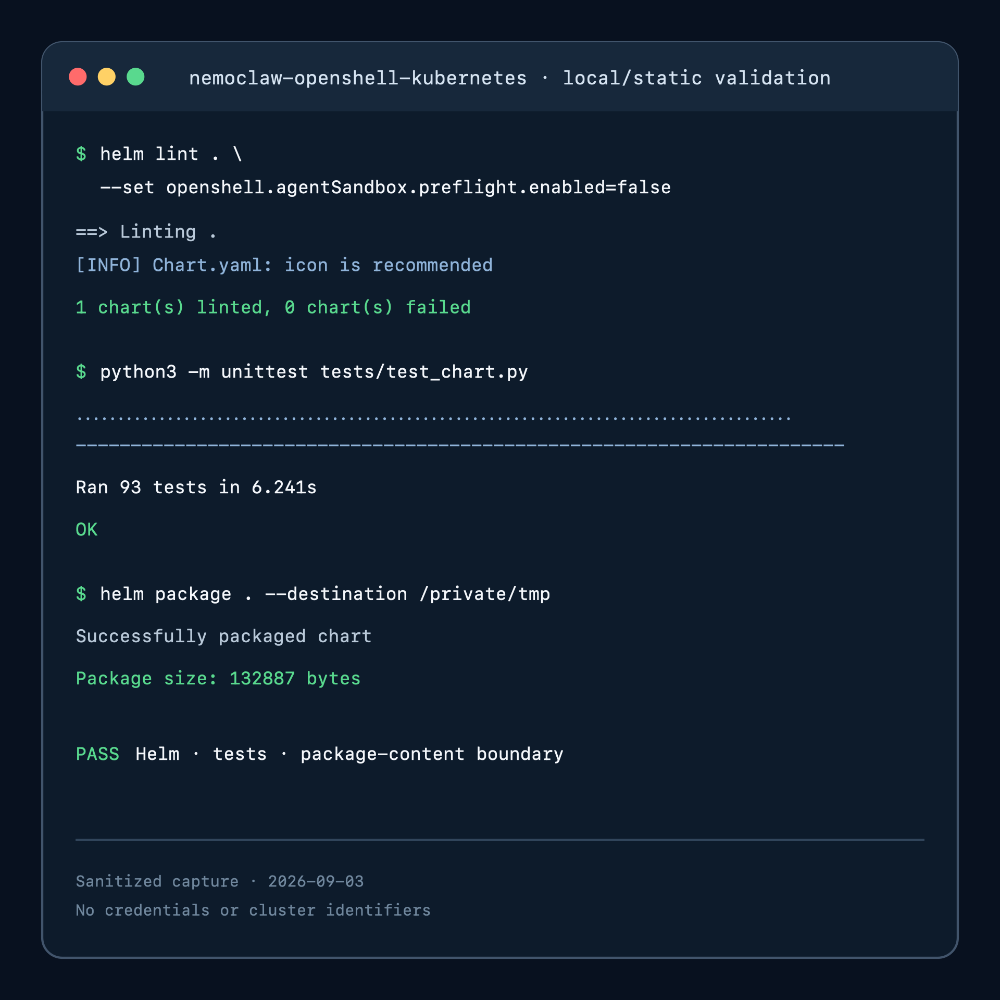
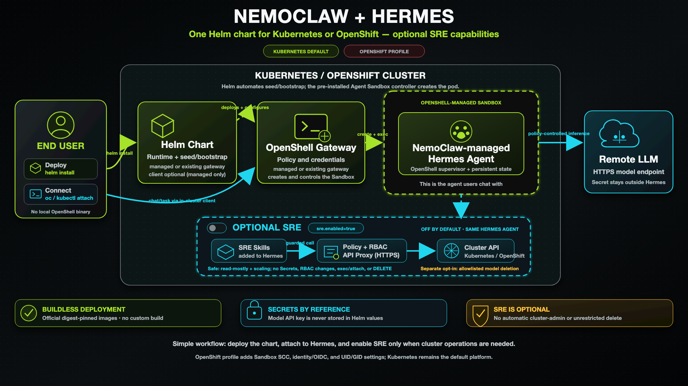

<!--
  SPDX-FileCopyrightText: Copyright (c) 2026 NVIDIA CORPORATION & AFFILIATES. All rights reserved.
  SPDX-License-Identifier: Apache-2.0
-->

# NemoClaw OpenShell Kubernetes

| Catalog field | Value |
| --- | --- |
| Description | Deploys a buildless NemoClaw-managed Hermes agent behind OpenShell on Kubernetes or OpenShift, with in-cluster chat and optional policy-bounded SRE skills. |
| Industry | ✨ Other |
| Requirements | Kubernetes 1.33+ or OpenShift 4.20+ · Helm 3.14+ · Agent Sandbox controller · RWO StorageClass · model API-key Secret · privileged sandbox admission |
| NemoClaw | v0.0.117 |
| Harness | Hermes 0.19.0 |
| OpenShell | 0.0.116 |
| Reviewed | 2026-09-03 |
| Upstream | https://github.com/NVIDIA/NemoClaw |

A buildless Helm recipe that runs the official NemoClaw-managed Hermes image
through the official OpenShell gateway on Kubernetes or OpenShift. It does not
include Hermes WebUI, SkillSpector, or NemoClaw recipe delivery.

## Screenshot



This sanitized terminal capture shows the chart's reproducible local validation
result. The exact commands and searchable expected output are preserved in
[Verification](#verification).

## Architecture



The end user attaches to the in-cluster client with `kubectl` or `oc`; OpenShell
creates and confines the NemoClaw-managed Hermes Sandbox. The Kubernetes SRE
skill and its policy-bounded API proxy are absent unless explicitly enabled.

## At A Glance

| Question | Answer |
| --- | --- |
| Category | NVIDIA Recipe |
| Contributor or provenance | NVIDIA |
| Use this when | A Kubernetes or OpenShift operator wants a NemoClaw-managed Hermes agent without building an image or installing a local chat client. |
| You will get | An OpenShell gateway, a sandboxed Hermes agent, optional in-cluster chat, and optional policy-bounded SRE skills. |
| Runs on | Kubernetes 1.33+ or OpenShift 4.20+ with an Agent Sandbox controller and a ReadWriteOnce StorageClass. |
| Requires | Helm 3.14+, privileged sandbox admission, and a pre-created model API-key Secret. |
| Verified on | OpenShift 4.20.28 on amd64 with Kubernetes 1.33.12 and Agent Sandbox controller 0.1.0. SRE-enabled and disabled modes were deployed live. Standard Kubernetes was rendered and tested only. |
| Evidence level | Live end-to-end for OpenShift; local/static for standard Kubernetes. |
| Support and maturity | Experimental Kubernetes deployment path with best-effort community support. See the repository [support policy](../../../../SUPPORT.md). |
| External access, data, and actions | Pulls pinned images from public registries and downloads checksum-pinned OpenShell and OpenShift CLI archives. Sends prompts to the configured model endpoint and may incur provider cost. Installation creates workloads, RBAC, NetworkPolicies, and retained PVCs. Optional SRE modes add cluster reads, scaling, or explicitly allowlisted model deletion. |
| Start here | [Prerequisites](#prerequisites) |
| Confirm success | [Verification](#verification) |

## Pinned release inputs

- NemoClaw/Hermes managed image: NemoClaw `v0.0.117`, Hermes `0.19.0`, immutable multi-architecture index digest in `values.yaml`
- OpenShell chart and CLI: `v0.0.116`; the dependency is vendored with narrow
  OpenShift dual-CA and UID-isolation template fixes, while gateway and
  supervisor images remain official immutable multi-architecture index digests
- OpenShift Client: `4.20.28`; official amd64 and arm64 archives are selected
  by node architecture and verified against pinned SHA-256 checksums
- Helper image: immutable multi-architecture Python digest; the chart builds no proxy or bootstrap image

No Dockerfile or image build is part of installation.

For a cluster outside the documented client-version skew, override
`sre.cli.version` plus both architecture URLs and checksums together with the
matching official OpenShift Client release. The chart never accepts an
unverified archive.

Hermes `0.21.0` is the newer standalone upstream release, but the latest
published NemoClaw-managed Hermes image remains `v0.0.117` with Hermes `0.19.0`.
The chart intentionally chooses that latest compatible managed image rather
than creating an unverified custom image or substituting a generic Hermes
container that lacks the NemoClaw/OpenShell runtime contract.

## Prerequisites

- Kubernetes 1.33+ or OpenShift 4.20+ with a `ReadWriteOnce` StorageClass; set `persistence.storageClass` when the cluster has no default
- Agent Sandbox CRD/controller serving `agents.x-k8s.io/v1alpha1` or `v1beta1`
- Helm 3.14+
- A model API key in a pre-created Secret; the key must not be placed in values or Helm command history
- Admission policy that permits the OpenShell combined-supervisor Sandbox. On
  standard Kubernetes this commonly requires an operator-prepared namespace
  with an appropriate privileged Pod Security Admission or equivalent policy;
  the chart deliberately does not create or relabel namespaces.

```bash
kubectl create namespace nemoclaw-hermes
kubectl -n nemoclaw-hermes create secret generic model-api-key \
  --from-literal=api-key='<model-api-key>'
helm upgrade --install nemoclaw-hermes . \
  --namespace nemoclaw-hermes \
  --set agent.model.name='<model-name>' \
  --set agent.model.baseUrl='https://model-endpoint.example/v1' \
  --wait --timeout 20m
```

The bootstrap Job registers the credential with OpenShell, configures `inference.local`, and asks OpenShell to create the Sandbox. The real key remains in the Kubernetes Secret/OpenShell credential path; Hermes receives only the managed inference sentinel.

HTTPS model endpoints are required by default. A plain HTTP endpoint is accepted
only when `agent.model.allowInsecureHttp=true` and
`agent.model.insecureHttpAcknowledgement=I_ACKNOWLEDGE_PLAINTEXT_MODEL_CREDENTIALS`;
that mode can expose the model credential on the network.

## In-cluster Hermes chat (no local OpenShell binary)

Set `operatorClient.enabled=true` during installation or upgrade to create one
attach-only in-cluster client for the existing OpenShell-managed Hermes
Sandbox. The client downloads the pinned OpenShell release artifact in an init
container, verifies its SHA-256 digest, and always starts the fixed
`openshell sandbox exec ... hermes` command. It does not contain Hermes,
NemoClaw, model credentials, or SRE credentials itself.

```bash
helm upgrade --install nemoclaw-hermes . \
  --namespace nemoclaw-hermes \
  --set operatorClient.enabled=true \
  --reuse-values \
  --wait --timeout 20m

oc -n nemoclaw-hermes attach -it \
  statefulset/nemoclaw-hermes-nemoclaw-openshell-kubernetes-operator-client \
  -c hermes-chat
```

The equivalent Kubernetes command is `kubectl attach`. Helm prints the exact
StatefulSet name for the release because long release names are truncated.
`oc attach` does not provide a detach-key option. To disconnect without ending
Hermes, close only the local terminal or terminate only the local `oc` process;
the client Pod continues running. `Ctrl-C` ends the current Hermes session, and
the client immediately starts a fresh session for the next attach.

Assign each client to one trusted operator at a time. One StatefulSet exposes
one persistent Hermes TTY, so do not share it among mutually untrusted users;
use a separate release/client identity per user when session isolation is
required.

The chart does not grant end-user RBAC. A user who is not already a namespace
administrator needs only `get` on `pods` and `create` on `pods/attach` for this
namespace. Do not grant `pods/exec`: attach is intentionally limited to the
fixed client process, while exec would let a user invoke arbitrary binaries in
the client container. Keep the release in a namespace where untrusted users
cannot create workloads or spoof chart pod labels.

The client uses a rotating, short-lived ServiceAccount token with only the
OpenShell user audience. A separate Pod-bound token is minted only inside the
bootstrap Job for lifecycle administration; the client refuses to start if
its token includes that admin audience. The feature is supported only with the
chart-managed gateway, where bootstrap can create the scoped workspace
membership.

## Platform selection

Kubernetes is the default. It pins UID/GID `1000` for the gateway and chart Jobs and renders no OpenShift SCC references.

Kubernetes user namespaces remain an operator opt-in through
`openshell.server.enableUserNamespaces=true`; use it only when Kubernetes
1.33+, the container runtime, kernel, storage driver, and GPU/runtime choices
all support that mode. The portable default is `false`.

OpenShift is explicit and deterministic. The supplied profile is the atomic
platform switch: it sets `platform.openshift.enabled=true` and all required
OpenShift overrides together.

```bash
helm upgrade --install nemoclaw-hermes . \
  --namespace nemoclaw-hermes \
  -f values-openshift.yaml \
  --wait --timeout 20m
```

`values-openshift.yaml` sets `platform.openshift.enabled=true`, removes the
portable UID/GID `1000`, and explicitly acknowledges a RoleBinding from only
the generated sandbox ServiceAccount to `system:openshift:scc:privileged`. The
chart never grants `cluster-admin`. Set `createPrivilegedSccBinding=false` only
when an operator has pre-provisioned the equivalent SCC grant. Rendering fails
if the OpenShift profile is selected but `security.openshift.io/v1` is
unavailable.

The OpenShift profile keeps user namespaces disabled and uses OpenShell's SCC
range resolution instead. Combining two UID-mapping mechanisms with retained
CSI subpath mounts is rejected at render time.

For a managed OpenShift gateway, the chart deliberately uses three IDs from the
release Namespace's SCC range: range start for short-lived lifecycle/proxy
workloads, start plus one for the gateway, and start plus two for the seed Job
and Hermes Sandbox. The official NemoClaw entrypoint retains its
`RLIMIT_NPROC=512` boundary, while Linux process accounting cannot combine the
gateway's threads with Hermes under one host UID. Helm reads the range from the
pre-created Namespace's `openshift.io/sa.scc.uid-range` annotation; therefore,
create the Namespace before installation and leave both
`openshell.server.openshift.gatewayUid.value=null` and
`openshell.server.openshift.sandboxUid.value=null` for live installs. The explicit
values exist only for deterministic offline rendering and must be set together
to distinct, namespace-valid IDs. Existing-gateway mode does not inject a local
UID into the external gateway's driver configuration. Kubernetes keeps UID/GID
`1000` and performs no OpenShift lookup. The OpenShift seed Job leaves
`fsGroup` unset so `restricted-v2` can inject the namespace-approved volume
group; its explicit `runAsUser` and `runAsGroup` remain start plus two.

The OpenShell supervisor changes the immutable image's `/sandbox` ownership to
that injected UID but preserves its set-id mode bits. Before starting Hermes,
the chart's fixed command refuses symbolic-link replacements, normalizes
`/sandbox` to `0770` and `/sandbox/.hermes` to `0700`, then uses `exec` to make
the official `/usr/local/bin/nemoclaw-start` the supervisor's direct child.
This is a runtime compatibility step only; it does not build or replace the
official image and does not weaken NemoClaw's own startup attestation.

The profile does not expose the OpenShell gateway with an OpenShift Route: the
bootstrap path is cluster-internal and mTLS-protected. Operators can configure
the upstream chart's Route separately only when external gateway access is
required and the certificate SANs have been prepared.

The chart does not auto-detect OpenShift: an auto-detected render can differ between CI, GitOps, and the target cluster.

`persistence.storageClass` is also the default for the chart-owned OpenShell
SQLite claim and `openshell.server.workspaceStorageClass` should be set to the
same or another RWO class for Sandbox workspaces when the cluster has no default
StorageClass. `gatewayPersistence.storageClass` can override only the gateway
database claim. The pre-created claim uses the exact name expected by the
upstream StatefulSet and is retained by default.

## Existing OpenShell gateway

Use `values-existing-gateway.yaml`, set the real HTTPS endpoint/name, and pre-create the referenced client mTLS Secret (`ca.crt`, `tls.crt`, `tls.key`) in the release namespace. Managed and existing modes are mutually exclusive. The default sandbox and model-provider names include a namespace/release identity hash so multiple namespaces can safely share one gateway. Any explicit `agent.sandbox.name` or `agent.model.providerName` override must remain globally unique within that gateway. If a provider already exists but no matching chart-owned sandbox proves ownership, bootstrap fails closed and requires operator review instead of changing that provider.

## Optional SRE skill

The default has no SRE skill, Kubernetes API proxy, or SRE RBAC. Enable the safe profile with `-f values-sre-safe.yaml`.

The chart ships two focused, NVIDIA-authored skill trees: `kubernetes-sre` and
the separately enabled `openshift-llm-deploy`. They are packaged as one
deterministic xz/tar bundle split into size-bounded ConfigMap chunks. The broad
third-party DevOps and infrastructure corpus is deliberately not distributed
by this chart; it requires separate source, license, and runtime review.

Each chunk, the reconstructed archive, its manifest, and every payload have
SHA-256 verification. Resources render only when `sre.enabled=true`; the seed
Job reassembles the chunks in memory, rejects links, traversal, unexpected
roots, binary/cache artifacts, and digest mismatches, then stages the selected
trees on the retained state volume.
Mounted skills, proxy credential, kubeconfig, and bundled `oc`/`kubectl`
clients are narrow read-only subpaths below the official image's existing
`.hermes` directory. The chart never replaces that protected directory or
builds a custom image.
The bundle builder injects the same cluster-safety contract into every packaged
`SKILL.md`; the source files remain reviewable and unmodified by packaging.

Safe mode can read common non-secret cluster resources and patch/update only
the `/scale` subresource of Deployments and StatefulSets. It cannot replace pod
templates, read Secrets, mutate RBAC, exec/attach, or delete. Hermes
authenticates to a dedicated chart proxy with a random chart-managed bearer
token stored in retained state; the SRE proxy's Kubernetes ServiceAccount token
is mounted only in the proxy pod. The OpenShell supervisor separately uses its
own short-lived projected identity token for gateway authentication. Set
`sre.proxy.authSecretRef.name` to use an operator-provided Secret instead.

All sandbox-to-proxy traffic uses CA-verified HTTPS because Kubernetes clients
will not send bearer credentials to plaintext HTTP servers. By default Helm
creates and preserves a private CA plus a serving certificate covering the SRE,
metrics, and model-deletion Service DNS names. Set
`sre.proxy.tlsSecretRef.name` to use an operator-managed
`kubernetes.io/tls` Secret containing the configured `ca.crt`, `tls.crt`, and
`tls.key` keys. Rotating an external CA requires the documented stopped-Sandbox
reseed so the private kubeconfigs receive the new public CA; never use
`--insecure-skip-tls-verify`.

NemoClaw routes Hermes egress through OpenShell's forward proxy. The chart marks
only its exact internal SRE, metrics, and model-deletion Service endpoints with
OpenShell `tls: skip`, preserving end-to-end private-CA TLS rather than allowing
OpenShell to replace the serving certificate. OpenShell still enforces exact
host, port, and binary policy; the authenticated chart proxies enforce the
allowed HTTP methods and resource paths, and NetworkPolicy limits the Sandbox
to those proxy workloads. The CLI binaries remain immutable files extracted
from the official architecture-specific OpenShift Client archive only after
SHA-256 verification.

`sre.rbac.mode=broad-no-delete` is a high-risk opt-in and requires `I_ACKNOWLEDGE_CLUSTER_WIDE_NO_DELETE`. It grants create/update/patch across API resources but still excludes all direct delete verbs and proxy DELETE requests. The proxy additionally rejects Secret, ServiceAccount-token, exec, attach, port-forward, pod-proxy, and node-proxy paths. This mode can still cause outages or indirect privilege escalation without DELETE; it is not recommended for production.

Enable the complete model-deployment skill separately. The chart references an
existing Hugging Face Secret by name/key; neither Helm nor Hermes reads, copies,
changes, or deletes that Secret. The one-time downloader receives the key only
through `secretKeyRef` and has no mounted ServiceAccount token.

```yaml
sre:
  enabled: true
  rbac:
    mode: broad-no-delete
    dangerousAcknowledgement: I_ACKNOWLEDGE_CLUSTER_WIDE_NO_DELETE
  openshiftLlmDeploy:
    enabled: true
    targetNamespace: nemoclaw-hermes
    hfTokenSecretRef:
      name: hf-token
      key: HF_TOKEN
```

On OpenShift, a Dynamo workload may require `anyuid`. The skill reports the
exact human-run `oc adm policy add-scc-to-user` command after an admission
failure; the skill and chart never grant that SCC or `cluster-admin`.

Measured Prometheus/Thanos telemetry is another explicit opt-in with
`sre.openshiftLlmDeploy.metrics.enabled=true`. It creates a separate proxy
identity that can issue only `GET` to the configured monitoring Service's
`query`/`query_range` paths. On OpenShift that identity receives the built-in
read-only `cluster-monitoring-view` role and trusts an automatically injected
OpenShift service CA; it has no workload mutation or Secret access. Standard
Kubernetes clusters must point the values at a compatible HTTPS Prometheus
Service and set `metrics.caConfigMapRef.name` when its certificate is not
anchored in the utility image's system roots. The proxy connects directly to
that exact Service DNS name because Kubernetes API Service proxying strips the
authorization credential required by OpenShift monitoring.

Namespace-scoped model deletion is a separate opt-in under
`sre.openshiftLlmDeploy.deletion`. It requires an exact namespace,
`I_ACKNOWLEDGE_NAMESPACE_MODEL_DELETE`, and at least one exact
`apiGroup`/plural `resource`/`name` tuple in `allowedResources`. Every delete
RBAC rule uses Kubernetes `resourceNames`; namespace scope or skill prose is
never treated as ownership. PVCs additionally require `deletePVCs=true` and a
separate cache-removal confirmation. Secret deletion is always rejected and no
cluster-scoped delete is granted.

```yaml
sre:
  enabled: true
  openshiftLlmDeploy:
    enabled: true
    deletion:
      enabled: true
      namespace: models-eval
      dangerousAcknowledgement: I_ACKNOWLEDGE_NAMESPACE_MODEL_DELETE
      allowedResources:
        - apiGroup: serving.kserve.io
          resource: inferenceservices
          name: my-model
```

## Lifecycle

The Hermes state PVC is retained by default. A sandbox created through the
OpenShell API is intentionally not a Helm-owned manifest, so `helm uninstall`
does not delete it. The chart labels the Sandbox with a digest of its effective
policy, driver configuration, model settings, environment, resources, and SRE
mode. An upgrade fails closed when an existing Sandbox has a different image or
configuration identity; inspect persisted state and explicitly recreate that
Sandbox through OpenShell before retrying.

## Verification

**Evidence level:** live end-to-end for the OpenShift path; local/static for
standard Kubernetes.

The completed OpenShift evaluation exercised both configurations:

- With SRE enabled, all chart workloads became Ready with zero restarts.
  Hermes returned `SRE_AGENT_OK`; allowed cluster and metrics reads succeeded,
  while Secret access and DELETE were denied.
- After a fresh installation with SRE disabled, all chart workloads became
  Ready with zero restarts. Hermes returned `HERMES_NO_SRE_FINAL_OK`; SRE
  skills, kubeconfigs, proxies, and RBAC were absent, and the external model
  Secret was preserved.

Run the local/static checks from this chart directory:

```bash
helm lint . --set openshell.agentSandbox.preflight.enabled=false
helm lint . -f values-openshift.yaml \
  --set platform.openshift.verifyApi=false \
  --set openshell.server.openshift.gatewayUid.value=1001200001 \
  --set openshell.server.openshift.sandboxUid.value=1001200002 \
  --set openshell.agentSandbox.preflight.enabled=false
python3 -m unittest tests/test_chart.py
python3 scripts/build-sre-skills-bundle.py
python3 ../../../../scripts/check_license_headers.py --check
helm template test . --api-versions agents.x-k8s.io/v1alpha1 >/tmp/rendered.yaml
helm template test . -f values-openshift.yaml \
  --set openshell.server.openshift.gatewayUid.value=1001200001 \
  --set openshell.server.openshift.sandboxUid.value=1001200002 \
  --api-versions agents.x-k8s.io/v1alpha1 \
  --api-versions security.openshift.io/v1 >/tmp/rendered-openshift.yaml
```

**Expected result:**

```text
All 703 checked source files have SPDX headers.
Ran 93 tests
OK
```

**This verifies:** chart schema and rendering for both platform profiles,
deterministic SRE-bundle integrity, policy/RBAC guardrails, package contents,
and the documented OpenShift evaluation workflow.

**This does not verify:** a live standard Kubernetes deployment,
existing-gateway mode, broad-no-delete mode, namespace-scoped model deletion,
production scale, or availability.

Rebuild the bundle only after reviewing the allowlisted source trees. The
builder requires the core skill entrypoints; includes every nested `SKILL.md`
plus allowlisted runtime-support directories; rejects empty, non-UTF-8,
oversized, or symlinked files; ignores hidden/cache artifacts and excluded
roots; emits size-bounded chunks; and produces byte-identical output for
identical inputs.

Enabling SRE or changing this bundle on an existing release is an explicit
reseed operation because the retained RWO volume can already be mounted by the
running Sandbox. Stop and remove that Sandbox through OpenShell, then upgrade
with `lifecycle.seed.runOnUpgrade=true` and
`lifecycle.seed.dangerousAcknowledgement=I_ACKNOWLEDGE_SANDBOX_STOPPED`. The
bundle digest is part of the Sandbox configuration identity so a stale running
Sandbox cannot be presented as using the new skill bundle.

## Teardown

Deleting the Sandbox destroys its active Hermes sessions. Inspect the exact
name first, then perform this reviewed lifecycle action before uninstalling the
release:

```bash
openshell sandbox get <sandbox-name>
openshell sandbox delete <sandbox-name>
helm uninstall nemoclaw-hermes --namespace nemoclaw-hermes
```

The Hermes workspace and gateway PVCs are retained by default. Inventory and
back up their contents before separately deleting any retained claim; the chart
does not remove them automatically.

## Known Limitations

- The OpenShell Kubernetes path is experimental and requires privileged
  Sandbox admission prepared by the cluster operator.
- OpenShift requires the explicit `values-openshift.yaml` profile; platform
  auto-detection is intentionally disabled.
- The in-cluster attach client is for one trusted operator. Use separate
  releases for mutually untrusted users.
- The attach client is supported only with the chart-managed gateway.
- Standard Kubernetes has local/static render coverage but has not been
  exercised live by this contribution.
- `broad-no-delete` can still cause outages or indirect privilege escalation
  and is not recommended for production.

## Provenance and Support

This NVIDIA-authored recipe adapts the official NemoClaw, Hermes, and OpenShell
release artifacts without building custom images. It is experimental and
provided with best-effort community support under the repository
[support policy](../../../../SUPPORT.md).

## Third-Party Dependencies

See this chart's [third-party notices](THIRD-PARTY-NOTICES) and the repository
[third-party notices](../../../../THIRD-PARTY-NOTICES) for upstream licenses,
versions, immutable artifacts, and local modifications.
