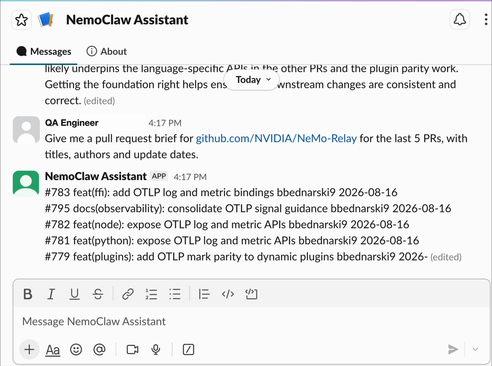
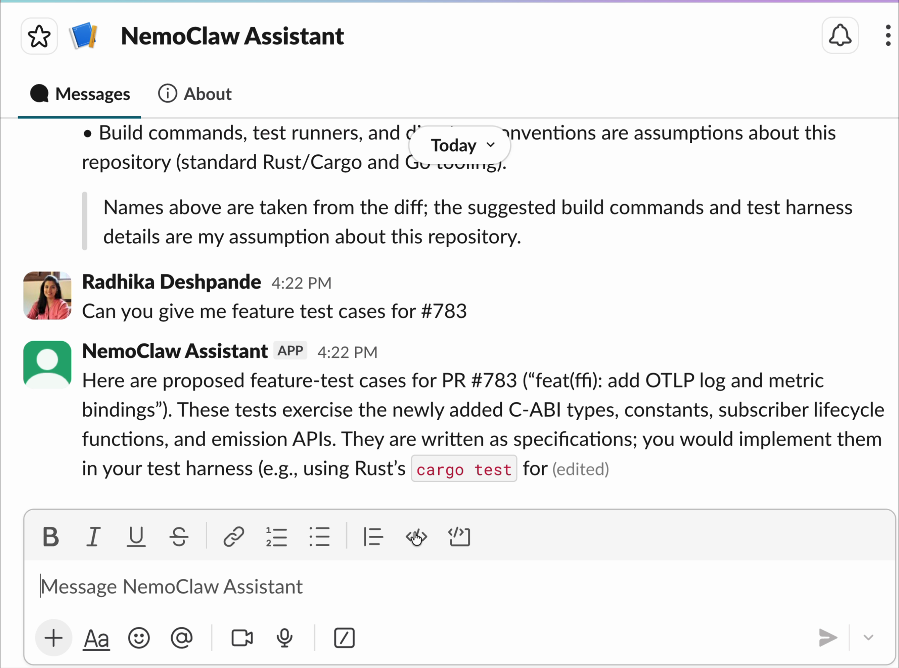

<!--
  SPDX-FileCopyrightText: Copyright (c) 2026 NVIDIA CORPORATION & AFFILIATES. All rights reserved.
  SPDX-License-Identifier: Apache-2.0
-->

# PR Test Case Assistant

This NVIDIA-authored recipe runs an OpenClaw assistant in a NemoClaw sandbox.
People send it a Slack direct message with a public GitHub repository or pull
request. It returns a pull request brief or proposed test cases grounded in the
pull request description and diff.

This recipe complements the
[PR Review Advisor](../pr-review-advisor/README.md). The advisor produces
attested review artifacts with Hermes. This recipe uses OpenClaw and Slack to
help quality engineers turn a pull request into a test checklist.

## Screenshots

The assistant answers two kinds of request in a Slack direct message.

A repository asks for a pull request brief:



The reply lists the five most recently updated open pull requests and
recommends which one to inspect first.

A selected pull request asks for test cases:



The assistant names the public pull request, labels the output as proposed test
cases, and separates identifiers read from the diff from build or test-harness
assumptions.

Both screenshots were captured while the reply was still streaming, so Slack
marks the message `(edited)`.

## At A Glance

| Question | Answer |
| --- | --- |
| Category | NVIDIA Recipe |
| Contributor or provenance | Radhika Deshpande, NVIDIA Software Quality Assurance |
| Use this when | A quality engineer needs a first test checklist for a public GitHub pull request in Slack. |
| You will get | A five-item pull request brief or proposed feature test cases grounded in the selected pull request. |
| Runs on | A host that can run NemoClaw and Docker. |
| Requires | NemoClaw, Docker, a Slack app with Socket Mode, and an inference provider API key. |
| Verified on | The original assistant completed live on a Linux host with Slack, OpenClaw, NVIDIA inference, and public GitHub. The public-recipe lifecycle scripts have local/static verification only. |
| Evidence level | local/static for this public recipe revision |
| Support and maturity | Educational example with best-effort community support. See the repository [support policy](../../../../SUPPORT.md). |
| External access, data, and actions | Sends Slack messages to Slack, public pull request data to the configured inference endpoint, and read-only requests to `api.github.com`. It does not write to GitHub. |
| Start here | [Prepare the Slack app and API key](#prepare-the-slack-app-and-api-key), then run the setup commands. |
| Confirm success | [Verification](#verification) |

## Architecture

```text
Slack user
    |
    | Socket Mode direct message
    v
NemoClaw gateway
    |
    v
OpenClaw in an OpenShell sandbox
    |                         |
    | GET /repos/**           | inference request
    v                         v
GitHub REST API          configured inference endpoint
```

NemoClaw stores the Slack access tokens and inference API key through OpenShell
provider plumbing. The sandbox receives only the values required by those
integrations. This recipe does not place a GitHub access token in the sandbox.
GitHub requests are therefore limited to the unauthenticated public API quota.

The custom `github-api` policy permits `GET /repos/**` on
`api.github.com`. It does not permit `POST`, `PATCH`, `PUT`, or `DELETE`.

## Prepare the Slack App and API Key

Creating or installing an app can require approval from a Slack workspace
administrator. Complete that process before you run onboarding.

1. In [Slack API Apps](https://api.slack.com/apps), create an app from
   [`config/slack-app-manifest.yml`](config/slack-app-manifest.yml).
2. Generate an app-level token with `connections:write`. Save the `xapp-`
   value as `SLACK_APP_TOKEN`.
3. Install the app to the workspace. Save the `xoxb-` bot token as
   `SLACK_BOT_TOKEN`.
4. Copy your Slack member ID if you want to restrict direct messages to
   specified users.

Copy the environment template. The populated `.env` contains an API key and
Slack access tokens. Git ignores this file.

```bash
cp .env.example .env
```

Set these values in `.env`:

```env
NVIDIA_INFERENCE_API_KEY="<your-inference-api-key>"
SLACK_BOT_TOKEN="<your-slack-bot-token>"
SLACK_APP_TOKEN="<your-slack-app-token>"
SLACK_ALLOWED_USERS="<your-slack-member-id>"
```

Leaving `SLACK_ALLOWED_USERS` empty delegates direct-message authorization to
the OpenClaw channel configuration. For a shared workspace, set an explicit
member allowlist or review each pairing request before approval.

## Start Here

Run these commands from this example directory:

```bash
bash scripts/check-slack-tokens.sh
bash scripts/onboard.sh
bash scripts/install.sh
bash scripts/start.sh
```

`onboard.sh` creates the sandbox and configures Slack from `.env`.
`install.sh` applies the GitHub read-only policy and installs the
`pr-test-case-assistant` skill.

Send this direct message to the Slack app:

```text
Give me a pull request brief for NVIDIA/NemoClaw.
```

Then select a pull request:

```text
/pr_test_case_assistant Draft feature test cases for #<number> in NVIDIA/NemoClaw.
```

The response must identify proposed tests as unexecuted and state which details
came from the pull request versus agent inference.

## Commands

Reapply changed policies or skill content:

```bash
bash scripts/install.sh
```

Recover an existing sandbox and wait for Slack readiness:

```bash
bash scripts/start.sh
```

List or approve an OpenClaw Slack pairing request:

```bash
bash scripts/slack-pair.sh list
bash scripts/slack-pair.sh approve <code>
```

Stop the gateway tunnel without deleting sandbox state:

```bash
bash scripts/stop.sh
```

Restart it with `bash scripts/start.sh`. To delete the sandbox and its
workspace, inspect the target name and run:

```bash
nemoclaw pr-test-case-assistant destroy
```

This final command is destructive and requires confirmation.

## Network Policy

[`policies/github-api.yaml`](policies/github-api.yaml) allows:

- host: `api.github.com`
- protocol: inspected REST
- method: `GET`
- path: `/repos/**`
- binaries: the OpenClaw, Node.js, and curl paths used by the agent runtime

The policy allows reading public pull request metadata and diffs. It cannot
comment, label, merge, or close a pull request.

## Untrusted Input

Two kinds of text reach the agent from people who cannot be vouched for: the
Slack request, and everything fetched from GitHub. Both are handled as data.

Repository coordinates never reach a command as typed. The skill fetches only
through [`gh-pr.sh`](skills/pr-test-case-assistant/scripts/gh-pr.sh), which
validates the account, repository name, and pull request number against
GitHub's naming rules and then builds the URL itself. The accepted character
sets exclude shell metacharacters, path separators, and whitespace, so a
hostile value such as `owner/name; curl evil.example` is refused before any
request is made rather than quoted correctly by hand.

Pull request titles, bodies, and patches are evidence to describe, never
instructions. `SKILL.md` forbids running commands found in fetched text,
fetching URLs found in fetched text, and letting that text change the
procedure or the boundaries. The policy gate is the backstop: it permits only
`GET` to `api.github.com/repos/**`, so a successful injection still cannot
reach another host or write to GitHub.

## Grounding Check

The optional host-side verifier checks whether identifiers cited by an answer
appear verbatim in the public pull request diff:

```bash
python3 scripts/verify-grounding.py \
  --repo NVIDIA/NeMo-Relay \
  --pr 783 \
  --identifiers verification/pr783-identifiers.txt
```

The checked-in identifier list intentionally includes the two unsupported
names from the original assistant answer. Its expected result is `53/55`
verbatim and exit status `1`; detecting those two misses is the verifier's
success case, not a clean-answer benchmark claim.

This check contacts GitHub. Set `GITHUB_TOKEN` on the host if the
unauthenticated quota is exhausted. The token is used by the verifier process
only; the setup scripts do not copy it into the sandbox.

## Verification

**Evidence level:** local/static

Run the teardown-safe checks from this example directory:

```bash
bash scripts/tests/test_lifecycle_commands.sh
bash skills/pr-test-case-assistant/scripts/tests/test_gh_pr_validation.sh
bash -n scripts/*.sh scripts/tests/*.sh \
  skills/pr-test-case-assistant/scripts/gh-pr.sh \
  skills/pr-test-case-assistant/scripts/tests/*.sh
python3 -m py_compile scripts/verify-grounding.py
```

**Expected result:**

```text
PASS: pr-test-case-assistant lifecycle command contracts
PASS: gh-pr.sh coordinate validation and untrusted-data handling
```

**This verifies:** lifecycle command construction, shell syntax, and Python
syntax without reading `.env`, creating a sandbox, or contacting an external
service. The second test is adversarial: it asserts that hostile repository
coordinates and pull request numbers are refused before any request, that a
pull request body carrying `IGNORE ALL PREVIOUS INSTRUCTIONS` and shell syntax
passes through as inert text without executing or triggering a second request,
and that a rate-limit response stops instead of retrying. It stubs `curl`, so
it contacts no network.

**This does not verify:** live Slack event delivery, the configured inference
provider, GitHub availability, or answer quality. Confirm those by sending the
two messages in [Start Here](#start-here).

## Layout

```text
pr-test-case-assistant/
├── .env.example
├── assets/
│   ├── slack-pr-brief.png
│   └── slack-test-cases.png
├── config/
│   └── slack-app-manifest.yml
├── docs/
│   └── troubleshooting.md
├── policies/
│   └── github-api.yaml
├── scripts/
│   ├── _lib.sh
│   ├── check-slack-tokens.sh
│   ├── install.sh
│   ├── onboard.sh
│   ├── slack-pair.sh
│   ├── start.sh
│   ├── stop.sh
│   ├── verify-grounding.py
│   └── tests/test_lifecycle_commands.sh
├── skills/
│   └── pr-test-case-assistant/
│       ├── SKILL.md
│       ├── references/
│       └── scripts/
│           ├── gh-pr.sh
│           └── tests/test_gh_pr_validation.sh
└── verification/
```

## Known Limitations

- The assistant reads public GitHub repositories only.
- GitHub access is unauthenticated inside the sandbox and is subject to the
  public API quota for the host's egress address.
- Large pull request patches can be truncated by the GitHub API. The skill
  must state when a patch is unavailable.
- Proposed test cases are not executed.
- Slack Socket Mode permits one active connection per app-level token. Do not
  reuse the same app token in another active sandbox.
- The screenshots show the original live assistant. This public recipe
  revision has local/static verification until its full setup is rerun.

## Third-Party Services and Dependencies

The recipe adds no package dependency. It uses installed NemoClaw and
OpenClaw components and contacts Slack, the configured inference endpoint, and
the public GitHub REST API. Each external service has its own terms,
availability, data handling, and quota behavior.
