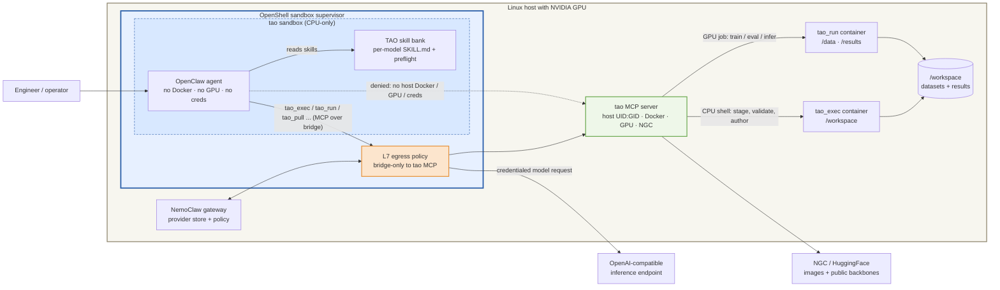

# NVIDIA TAO Toolkit — Computer Vision Model Engineer

A NemoClaw community recipe for an always-on agent that trains, evaluates, and
runs inference on computer-vision models with
[NVIDIA TAO Toolkit](https://developer.nvidia.com/tao-toolkit) — object
detection, segmentation, classification, pose, OCR, visual inspection, and
more — on a host GPU.

The agent is a **control-plane agent**. It never holds host credentials and
never touches Docker, the GPU, or NGC directly. It drives everything through a
host-side `tao` MCP server across **two planes joined by one shared workspace**:

- **`tao_exec` — the CPU shell.** A confined, GPU-less container over the host
  workspace at `/workspace`. Everything that is not GPU compute happens here:
  inspecting data, authoring specs, unpacking archives, and staging models and
  datasets (`huggingface_hub` / `ngcsdk` / `curl`). It runs as the host user, so
  every file it writes is owned by that user — not root.
- **`tao_run` — the GPU job.** Each call launches one fresh GPU container for a
  heavy job (train / evaluate / inference / export), mounting the chosen
  workspace subdirs at `/data` and `/results`.

Docker, the GPU, and NGC credentials stay on the host behind the MCP server. A
prompt cannot make the agent reach them directly — the OpenShell sandbox has no
Docker socket, no GPU, and no host credentials.

## Deployment model

This recipe runs on a single Linux host or VM with an NVIDIA GPU. The host runs
Docker with the NVIDIA Container Toolkit and is logged in to NGC. The NemoClaw
gateway supervises a CPU-only OpenShell sandbox on the same host; the agent
inside it reaches the host-side `tao` MCP server over the Docker bridge
(`host.openshell.internal`). The server, not the agent, owns the GPU and
credentials.

This is an educational, single-host deployment — not a managed training
platform. Production adopters should preserve its control boundaries (agent has
no host GPU/credential access; all GPU work goes through the audited MCP server)
while pointing the workspace at their own datasets and storage.

## Architecture



The central property is the split between the control-plane agent and the
host-side executor. The agent decides *what* to run and prepares inputs in the
CPU shell; the MCP server is the only component that touches Docker, the GPU,
and NGC — and it launches every container as the host user with dropped
capabilities.

## Key invariants

- The agent can inspect data, stage models, author specs, and launch/monitor
  jobs; it cannot reach the host Docker socket, GPU, or NGC credentials.
- File preparation and model/dataset staging run in a **CPU-only** `tao_exec`
  shell — never a GPU container. A trivial file copy never spins up a GPU.
- Every container (shell and GPU job) runs as the host `UID:GID` with
  `--cap-drop ALL`; outputs are owned by the host user and removable without
  `sudo`.
- Heavy compute is a one-shot `tao_run` GPU job that releases the GPU on exit.
- Datasets are validated on the host **before** any GPU launch. A malformed
  dataset fails in under a second instead of minutes into a container.

## Agent tools and skills

The agent drives TAO through the host `tao` MCP server:

| Tool | Purpose |
|---|---|
| `tao_exec` | Run a shell command in the CPU workspace container (inspect, stage, author, validate). |
| `tao_pull` | Pull an NGC image to the host cache (the one slow, uncapped call). |
| `tao_run` | Launch a GPU training / evaluation / inference / export job. |
| `tao_status` / `tao_logs` / `tao_list` | Monitor and recover jobs. |
| `tao_stop` / `tao_rm` / `tao_cleanup_results` | Stop, remove, and clean a job's isolated results. |

Model behavior comes from the [TAO skill bank](https://github.com/NVIDIA-TAO/tao-skills-bank):
each `models/tao-train-*` skill documents the exact container image, action
command, spec schema, dataset contract, and a mandatory host-side **pre-flight**
(for example the Visual ChangeNet classify preflight that rejects absolute CSV
paths, flat-vs-directory layouts, single-class training sets, and oversized
batches before launch).

## Intended user journey

1. Bring up the NemoClaw gateway, the CPU-only `tao` sandbox, and the host `tao`
   MCP server.
2. Put a dataset under the host workspace (`~/tao-workspace/<name>/`).
3. Ask the agent to train, evaluate, or run inference on a model (e.g. "train
   Visual ChangeNet classify on my AOI dataset"). It reads the skill, runs the
   dataset pre-flight in the CPU shell, stages the public backbone, pulls the
   image, launches the GPU job, and reports results.
4. Watch it refuse a malformed dataset on the host before wasting a GPU
   spin-up — the same pre-flight runs ahead of every launch.

## Requirements

- Linux `x86_64` or `aarch64` host with an NVIDIA GPU (16 GB+ VRAM).
- Docker with the NVIDIA Container Toolkit, logged in to NGC
  (`docker login nvcr.io`, user `$oauthtoken`).
- The NemoClaw / OpenShell CLI with a running local gateway.
- [`uv`](https://astral.sh/uv) on `PATH` (runs the MCP server).
- An OpenAI-compatible inference key for the agent.
- Optional: `HF_TOKEN` only if a skill uses a gated HuggingFace backbone; public
  backbones (e.g. `nvidia/C-RADIOv2-B`) need no token.

- Roughly 40 GB of free disk. The TAO PyTorch image alone is **~27 GB**, pulled
  from NGC on first use; budget 15–30 minutes for that pull on a first run.

Review NGC and third-party license terms before use; the community repository
records third-party components in its root `THIRD-PARTY-NOTICES` file.

## Quick start

```console
$ cp .env.example .env
$ # Edit .env: set NEMOCLAW_PROVIDER_KEY (and NGC_API_KEY / HF_TOKEN if needed).
$ bash scripts/bring-up.sh
```

`bring-up.sh` clones the public TAO skill bank, ensures a CPU-only `tao`
sandbox, and runs the bank's `integrations/nemoclaw/setup-tao-nemoclaw.sh`,
which starts the host `tao` MCP server (bound to the Docker bridge), installs
the skill bank into the sandbox, resolves the pinned TAO image for the shell,
adds the bridge egress policy, and reloads the gateway. It is also the resume
command: rerunning it reuses a healthy sandbox, and reuses an MCP server that is
already answering on `:9901` rather than restarting it — run
`scripts/tear-down.sh` first if you changed the workspace or the skill bank ref.
The first run pulls the ~27 GB TAO image, which dominates setup time.

Then connect to the sandbox and ask the agent what it can do:

```console
$ nemoclaw tao agent --agent main -m "What TAO models can you train, and what data do you need?"
```

## Verify the deployment

```console
$ bash scripts/verify.sh
```

The verification first confirms the MCP server is running, the sandbox reaches
it over the bridge, and the skill bank is installed. It then runs the recipe's
real workload: **one prompt that drives a full TAO train → evaluate → inference
cycle on the host GPU**, using nothing but public assets.

The agent stages the [`beans`](https://huggingface.co/datasets/AI-Lab-Makerere/beans)
leaf-disease dataset (MIT, 3 classes, ~1.3k images) and a public ImageNet
`resnet_18` backbone ([`timm/resnet18.a1_in1k`](https://huggingface.co/timm/resnet18.a1_in1k),
Apache-2.0) in the CPU shell, then launches three GPU jobs and reports the
accuracy and its predictions:

```text
==> Train -> evaluate -> inference on public data
  [ok]   agent trained a classifier on public data (val_acc_1 = 0.9172932505607605)
  [ok]   inference wrote 128 predictions to .../inference/.tao-jobs/<job>/result.csv
         /data/test/healthy/healthy_test.7.jpg,healthy,0.8211978077888489
VERIFY: PASS
```

`verify.sh` asserts against the artifacts on the host — the accuracy in
`status.json` and the prediction rows in `result.csv` — not against what the
agent says it did. Training is seeded and `cudnn.deterministic` is on, so the
accuracy is reproducible run to run.

Expect 7–9 minutes end to end on a single modern GPU, plus a ~180 MB dataset
download the first time. See
[`docs/verify-functionality.md`](docs/verify-functionality.md) for the full
walkthrough and troubleshooting.

## Repository layout

```text
scripts/         phased bring-up, verification, and teardown
.env.example     inference key and optional NGC / HF tokens
docs/            verification walkthrough and dataset-staging notes
```

The TAO integration itself (the `tao` MCP server, `setup-tao-nemoclaw.sh`, and
the per-model skills) lives in the
[TAO skill bank](https://github.com/NVIDIA-TAO/tao-skills-bank) under
`integrations/nemoclaw/`; this recipe wraps it into a NemoClaw-native
bring-up / verify / teardown flow.

## Teardown

The safe default stops the host `tao` MCP server and leaves the workspace and
sandbox intact:

```console
$ bash scripts/tear-down.sh
```

Explicitly remove the sandbox as well:

```console
$ bash scripts/tear-down.sh --destroy-sandbox
```

The workspace under `~/tao-workspace` (datasets, checkpoints, results) is never
deleted by teardown; remove it yourself when you no longer need the artifacts.

## Data and safety

- Datasets and checkpoints stay on the host under `~/tao-workspace`; the agent
  reaches them only through the MCP server.
- NGC and inference credentials live in the host provider store and the MCP
  server's environment, never in the sandbox.
- The verifier trains only on public, redistributable assets: the `beans`
  dataset (MIT) and the `timm/resnet18.a1_in1k` ImageNet backbone (Apache-2.0).
  No NGC model checkpoint is downloaded, and no token is needed for either.
- TAO's public HuggingFace weights are training *backbones*, not zero-shot
  checkpoints, so inference always follows a train step in this recipe.
- Never place production credentials or proprietary datasets you cannot share in
  a public deployment; this is an educational single-host example.
