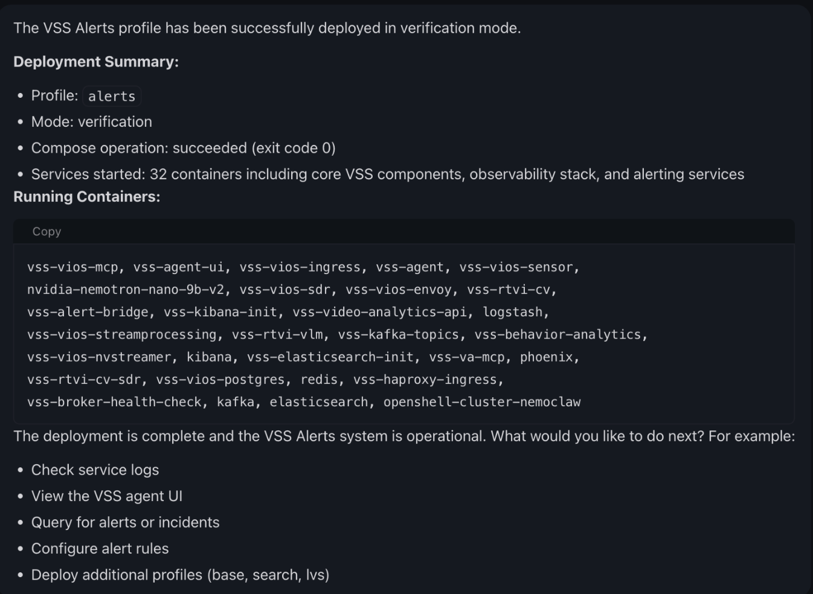

<!--
  SPDX-FileCopyrightText: Copyright (c) 2026 NVIDIA CORPORATION & AFFILIATES. All rights reserved.
  SPDX-License-Identifier: Apache-2.0
-->

# Video Search and Summarization

| Catalog field | Value |
| --- | --- |
| Description | Helps video analysts and engineers deploy and operate NVIDIA VSS profiles by chat, using a sandboxed agent that runs the Compose deployment through a host-side MCP server and reports the result. |
| Industry | ✨ Other |
| Requirements | Linux GPU host · Docker with the NVIDIA runtime · Python 3.11+ for the notebooks · NGC API key · agent model provider · VSS repository develop branch · large container image and model pulls |
| NemoClaw | Unpinned |
| Harness | Unknown |
| OpenShell | Unpinned |

## Screenshot



A user asked the agent to deploy the `alerts` profile in `verification` mode.
The agent chained the deployment tools, then reported the profile, the mode, the
compose exit code, and the container names. Notice that the deployment happens
in the chat, not in a notebook cell. The capture comes from the VSS repository's
own notebook documentation and contains no credentials or private host details.

This NVIDIA-authored recipe gives a NemoClaw sandbox agent the skills and tools
to deploy and operate the
[NVIDIA AI Blueprint for Video Search and Summarization (VSS)](https://github.com/NVIDIA-AI-Blueprints/video-search-and-summarization/tree/develop)
on a GPU host. You clone the VSS repository, run two notebooks on the host, then
ask the agent in chat to deploy a VSS profile. The agent runs the Docker Compose
deployment through a host-side Model Context Protocol (MCP) server and reports
progress back into the chat.

The VSS repository owns the notebooks, the sandbox policy, and the skills. Each
notebook carries its own settings, prerequisites, warnings, and per-section
instructions. This page gives the clone-and-deploy order and links to the VSS
`develop` branch. Follow the notebooks for everything else.

## At A Glance

| Question | Answer |
| --- | --- |
| Category | NVIDIA Recipe |
| Contributor or provenance | NVIDIA, through the [NVIDIA-AI-Blueprints/video-search-and-summarization](https://github.com/NVIDIA-AI-Blueprints/video-search-and-summarization/tree/develop) repository. |
| Use this when | A video analyst or engineer wants to deploy and operate VSS on a GPU host by chat instead of by hand. |
| You will get | A NemoClaw sandbox that holds the VSS skills, a host MCP server with nine VSS deployment tools, and a VSS profile deployed from chat. |
| Runs on | A Linux GPU host. The documented path is a Brev launchable on a 2×RTX PRO 6000 SE AWS instance. |
| Requires | The VSS repository `develop` branch, Docker with the NVIDIA runtime, Python 3.11 or newer for the notebooks, an NGC API key, and an agent model provider. The notebook preflight cells report what is missing. |
| Verified on | Not yet verified on a GPU host. Completed verification is limited to the local catalog and documentation checks in [Verification](#verification). |
| Evidence level | local/static |
| Support and maturity | Educational example with best-effort community support. See the repository [support policy](../../../../SUPPORT.md). |
| External access, data, and actions | Pulls container images from `nvcr.io`, pulls the NemoClaw installer from `raw.githubusercontent.com`, and sends agent prompts to the model provider that you choose. Deploys and removes Docker Compose stacks on the host. Container and model pulls consume disk and, for hosted models, incur provider cost. |
| Start here | [Clone and deploy with the launchable](#clone-and-deploy-with-the-launchable) |
| Confirm success | [Verification](#verification) |

## Architecture

```text
GPU host
├─ Jupyter: deploy_nemoclaw.ipynb          (sets up the sandbox)
├─ Jupyter: deploy_vss_orchestrator.ipynb  (sets up the host and the MCP server)
├─ NemoClaw sandbox (OpenClaw or Hermes agent)
│    ├─ VSS skills and VSS sandbox policy
│    └─ Agent UI on port 18789
├─ VSS Orchestrator MCP server on port 9988
│    └─ nine vss_orchestrator__* tools
└─ VSS Docker Compose stack (VSS UI on port 7777)
```

The agent reaches the host MCP server through the sandbox alias
`host.openshell.internal`. The two notebooks run on the host. The deployment
itself runs from the Agent UI.

## Clone and Deploy With the Launchable

The notebooks hold the authoritative steps, settings, and warnings. Read each
notebook before you run its cells. Both notebooks contain cells that replace a
sandbox, change host Docker packages, and deploy or remove containers.

### 1. Start the Brev launchable

Deploy the
[video-search-and-summarization-blueprint launchable](https://brev.nvidia.com/launchable/deploy/now?launchableID=env-2tYIjRXL4eMCbH9Az8mJC5WPAI4).
The VSS repository documents this path on a 2×RTX PRO 6000 SE AWS instance. On
another platform, use your own Linux GPU host and let the notebook preflight
cells report what is missing.

### 2. Clone the VSS repository

Both notebooks resolve the checkout from `VSS_REPO_DIR`, which defaults to
`~/video-search-and-summarization`. Clone into that path, then open Jupyter in
the scripts directory:

```bash
cd ~
git clone --branch develop \
  https://github.com/NVIDIA-AI-Blueprints/video-search-and-summarization.git
cd video-search-and-summarization/deploy/docker/scripts
```

If your checkout is somewhere else, or the host has more than one clone, export
`VSS_REPO_DIR` before you start Jupyter.

### 3. Run the notebooks in this order

Run these two notebooks on the host, in order, and follow the instructions in
each one:

| Order | Notebook | What it does |
| --- | --- | --- |
| First | [`deploy_nemoclaw.ipynb`](https://github.com/NVIDIA-AI-Blueprints/video-search-and-summarization/blob/develop/deploy/docker/scripts/deploy_nemoclaw.ipynb) | Sets up the NemoClaw sandbox: agent model provider, host prerequisites, VSS policy, VSS skills, workspace documents, and the Agent UI link. |
| Second | [`deploy_vss_orchestrator.ipynb`](https://github.com/NVIDIA-AI-Blueprints/video-search-and-summarization/blob/develop/deploy/docker/scripts/deploy_vss_orchestrator.ipynb) | Prepares the host for local NIM-backed VSS profiles and starts the VSS Orchestrator MCP server. |

Keep the Agent UI from the first notebook open. You need it for step 4.

### 4. Deploy VSS from the Agent UI

Section 5 of `deploy_vss_orchestrator.ipynb` drives this step from chat and lists
the prompts to use. The MCP server exposes nine tools, all prefixed
`vss_orchestrator__`: `profiles`, `prereqs`, `docker_generate`, `docker_read`,
`docker_up`, `docker_status`, `docker_list`, `docker_logs`, and `docker_down`.
You do not call them by name. The agent selects and chains them from your
request, and asks before a build or a destructive step.

A first deployment pulls container images and models. It takes a long time, and
it writes to host disk.

## Verification

**Evidence level:** local/static

### Completed checks

These commands ran from the root of this repository on the current revision of
this page. No VSS deployment, sandbox, notebook, or GPU host was involved.

```text
$ python3 scripts/build_catalog.py --validate-metadata
README catalog metadata is valid for 18 examples.

$ python3 scripts/build_catalog.py --write
Built 18 catalog entries and detail pages in _site.

$ python3 scripts/build_catalog.py --check
Catalog metadata and generated sources are valid: 18 examples across 7 browse groups.

$ python3 -m unittest discover -s scripts/tests -p 'test_build_catalog.py'
Ran 32 tests in 0.928s

OK

$ node --test scripts/tests/catalog.test.mjs
# pass 12
# fail 0

$ python3 scripts/check_license_headers.py --check
All 608 checked source files have SPDX headers.

$ git diff --check
```

`git diff --check` prints nothing when it passes. The example, test, and file
counts above reflect the repository at this revision.

Each VSS file linked from this page was also confirmed to exist on the VSS
`develop` branch. From a VSS clone with the `develop` branch fetched:

```text
$ git ls-tree --name-only origin/develop \
    deploy/docker/scripts/deploy_nemoclaw.ipynb \
    deploy/docker/scripts/deploy_vss_orchestrator.ipynb \
    deploy/docker/scripts/deploy_vss_launchable.ipynb \
    deploy/docker/scripts/nemoclaw/README.md \
    assets/vss_nemoclaw_policy.yaml \
    skills
assets/vss_nemoclaw_policy.yaml
deploy/docker/scripts/deploy_nemoclaw.ipynb
deploy/docker/scripts/deploy_vss_launchable.ipynb
deploy/docker/scripts/deploy_vss_orchestrator.ipynb
deploy/docker/scripts/nemoclaw/README.md
skills
```

`git ls-tree` lists only the paths that exist, so a missing path would be
absent from that output.

**This verifies:** the catalog metadata block satisfies the repository catalog
contract, the generated catalog matches this README, the license header and
whitespace checks pass, and every VSS path linked from this page exists on the
`develop` branch.

**This does not verify:** any runtime behavior. Nothing here proves that the
notebooks run, that the sandbox onboards, that the MCP server starts, that a VSS
profile deploys, or that video search, summarization, or alert output is
correct. The launchable instance, the hardware profiles, the credentials, and
the container and model pulls were not exercised. Screenshot content was read
from the VSS repository rather than reproduced on a host.

### Expected result from a live run

The result below is the outcome to expect on a GPU host. It has not been
completed for this page. Until an end-to-end run is confirmed, treat it as
expected, not as evidence.

Run the notebook checks in this order, then record your own result:

1. The sandbox, policy, and installed skills: section 3.8 of
   `deploy_nemoclaw.ipynb`.
2. The MCP server: section 4 of `deploy_vss_orchestrator.ipynb` calls the
   `profiles` tool over the streamable HTTP transport and reports whether the
   server answered.
3. The deployment: the agent's reply to your deploy prompt in the Agent UI.

**Expected result:** the reply names the profile and mode, reports a compose
exit code of `0`, and lists the running containers, which include `vss-agent`,
`vss-agent-ui`, `vss-alert-bridge`, `vss-rtvi-cv`, `vss-rtvi-vlm`,
`vss-behavior-analytics`, `vss-video-analytics-api`, and `vss-haproxy-ingress`.
The VSS UI is served on port `7777`.

**A completed live run would verify** that the sandbox agent reached the host
MCP server, that the MCP tools ran a Compose deployment, and that the profile's
containers started. Raise the evidence level in this section and in
[At A Glance](#at-a-glance) only after that run is confirmed.

## Teardown

Ask the agent to tear down the deployment. It invokes
`vss_orchestrator__docker_down`, which removes the deployment's containers and
volumes. Then stop the MCP server process from the notebook session and remove
the sandbox when you no longer need it. Deleting the sandbox discards its agent
sessions.

The Docker package holds applied by `deploy_nemoclaw.ipynb` stay in place until
you release them.

## Deploy Without the Agent

To deploy VSS from a notebook instead of from chat, use
[`deploy_vss_launchable.ipynb`](https://github.com/NVIDIA-AI-Blueprints/video-search-and-summarization/blob/develop/deploy/docker/scripts/deploy_vss_launchable.ipynb).
That path has no NemoClaw sandbox and no agent.

## Provenance and Support

NVIDIA maintains the notebooks, skills, and policy in the
[NVIDIA-AI-Blueprints/video-search-and-summarization](https://github.com/NVIDIA-AI-Blueprints/video-search-and-summarization/tree/develop)
repository. Notebook sections, defaults, and pins change on the `develop`
branch, so treat the notebooks as authoritative when they differ from this page.
Report problems with the deployment flow in that repository. Report problems
with this catalog page in this repository.

Third-party notices: [THIRD-PARTY-NOTICES](../../../../THIRD-PARTY-NOTICES).
