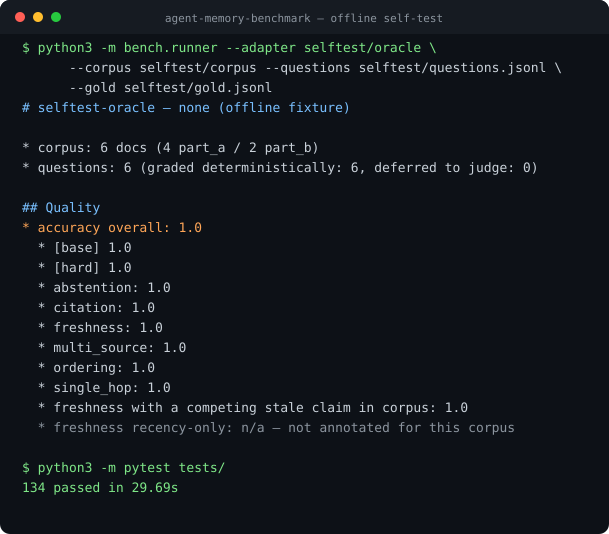

# mnemo — Agent Memory Benchmark

mnemo is a NemoClaw Community example that measures the memory a system builds
from a corpus: what it can answer afterwards, and what building it cost.

*Named for Mnemosyne, memory herself. The hard part is not remembering — it is
remembering the right version: a later message overturns an earlier one, and a
system worth using tells you the current answer, not the one it learned first.*

**Does your ingestion produce memory you can actually answer from — and what did
it cost you?**

Give a system six weeks of one person's email and chat. Let it build whatever
memory it likes: a wiki, a vector store, a graph, a pile of summaries. Then ask
it 186 questions about that corpus and check the answers.

Two numbers come out, and the benchmark refuses to collapse them into one:

* **quality** — did it answer correctly, keep up when a later message overturned
  an earlier one, and admit when the corpus does not say?
* **cost** — how many tokens went into building the memory, and how many into
  each answer?

That split is the point. A system that reasons hard at ingest time should answer
cheaply; a system that stores raw chunks pays on every question instead. Total
cost of ownership is `ingest_tokens + N × per_question_tokens`, and where the two
curves cross — at what N a heavy ingest pays for itself — is a question the
accuracy-only benchmarks we looked at do not report. If you know of one that
does, open an issue.

## Screenshot



The oracle adapter answers the six-document fixture correctly, so every type
reads `1.0` and the freshness split reports `n/a` for the group this fixture
does not annotate. The same command against `selftest/wrong` reports
`accuracy overall: 0.0` with every type at `0.0`. Both run with no model, no
network and no API key. The essential output, as searchable text:

```text
# selftest-oracle — none (offline fixture)

* corpus: 6 docs (4 part_a / 2 part_b)
* questions: 6 (graded deterministically: 6, deferred to judge: 0)

## Quality
* accuracy overall: **1.0**
  * [base] 1.0
  * [hard] 1.0
  * abstention: 1.0
  * citation: 1.0
  * freshness: 1.0
  * multi_source: 1.0
  * ordering: 1.0
  * single_hop: 1.0
…
```

The block continues with the evidence diagnostics and a Cost section; on the
offline fixture every token count is zero. A scored run against a real system
produces the same shape with those filled in.

## At A Glance

| Question | Answer |
| --- | --- |
| Category | Developer Tool |
| Contributor or provenance | NVIDIA |
| Use this when | You need to compare memory designs — consolidating, retrieval, or anything else — on the same corpus and the same questions. |
| You will get | Accuracy per question type, plus ingest and per-answer token cost measured at a proxy rather than self-reported. |
| Runs on | Any host with Python 3.9 or later, on macOS or Linux. The shipped adapter definitions invoke `python3`, which a default Windows install does not provide. |
| Requires | `pytest` for the offline check. To score a real system: an API key for an OpenAI-compatible endpoint, and an adapter for the system under test. |
| Verified on | Python 3.9.6 on macOS. Offline self-test and unit tests only; no scored run against a live endpoint is included as evidence here. |
| Evidence level | local/static |
| Support and maturity | Best-effort community support; see [SUPPORT.md](../../../SUPPORT.md). |
| External access, data, and actions | Scoring a real system sends corpus text and questions to the endpoint you point `--upstream` at, and you pay for those tokens. The harness writes only under `results/`; an adapter you add is not sandboxed and can write anywhere your user can. The offline self-test sends nothing and costs nothing. |
| Start here | [Checking it works](#checking-it-works) — offline; then [Running it](#running-it) for a scored run |
| Confirm success | [Checking it works](#checking-it-works) |

## The corpora

**Corpus A** — 425 documents: 200 emails and 225 channel-days of chat (559
messages), 2026-04-16 to 2026-05-27, a software platform-engineering team.

**Corpus B** — 173 documents: 100 emails and 73 channel-days (383 messages),
2027-07-20 to 2027-09-24, a construction program manager running three sites.
Written key-first and generated by a different model family, in a domain
deliberately far from corpus A's, so that a result on one can be checked against
the other. See [`corpus_b/README.md`](corpus_b/README.md) for how it was built
and what its audit did and did not fix.

Both corpora are fully synthetic. Every person, project, company, domain and
address in them is invented, and every message body was generated from a fixed
fictional cast defined before any document existed. Nothing was collected from a
live account.

It ships in two halves, and both are ingested in order:

```
corpus/part_a/   2026-04-16 .. 2026-05-11
corpus/part_b/   2026-05-12 .. 2026-05-27   # supersedes part_a in places
```

Two `ingest` calls, not one. Real memory has to survive being told something new
that contradicts what it already believed — a launch date moves, a hire is made,
a cost figure drops. Systems that can only rebuild from scratch may do so; their
ingest token count will say so.

## Running it

```bash
export OPENAI_API_KEY=<your key>
python3 -m bench.runner --adapter adapters/naive_rag
```

The shipped baselines default to `gpt-4o` and `text-embedding-3-small`, so that
runs as printed. To score a different model, set `model` in the adapter's
`adapter.json` — that is the id a result is filed under — and
`MNEMO_EMBED_MODEL` for the embedding model.

The proxy forwards to `https://api.openai.com` by default; `--upstream` (or
`MNEMO_UPSTREAM`) points it at any OpenAI-compatible gateway, where model ids
are often namespaced differently. An adapter that needs a host-specific path
declares it in its `env` block; anything already exported wins, so nothing
machine-specific has to be committed:

```bash
MY_SYSTEM_PYTHON=~/src/my-system/.venv/bin/python \
    python3 -m bench.runner --adapter adapters/my_system
```

The runner ingests both halves, feeds `questions/questions.jsonl` to your system,
grades the answers, and writes `report.json` + `summary.md` under `results/runs/`.

## Scoring a memory store that lives in this repository

`adapters/ledger_rag/` drives the [Memory-Driven Chief of
Staff](../../recipes/nvidia/memory-driven-chief-of-staff/README.md) ledger. It
loads the corpus into that recipe's own `schema.sql`, then answers by selecting
candidates out of the ledger and passing them to a model.

**Read its score carefully.** What it measures is candidate selection over the
ledger plus the model. It is not a score of the recipe's own behaviour: that
ledger is built for triage and ranking and has no question-answering path, so
the selection and the answer call belong to this adapter, not to the recipe.
Nothing in the adapter writes to or changes the recipe. Treat a number from it
as evidence that the harness can drive a memory store in this repository.

Ingest is plain SQLite and needs no network, which is why the offline check
covers it. Only the answer phase calls an endpoint.

```bash
python3 -m bench.runner --adapter adapters/ledger_rag
```

## Adding your system

Write an `adapter.json` with two commands:

```json
{
  "name": "my-system",
  "model": "some-model-id",
  "ingest": ["my-cli", "ingest", "--corpus", "{corpus}", "--state", "{state}"],
  "answer": ["my-cli", "answer", "--state", "{state}"]
}
```

`answer` reads `questions.jsonl` on stdin and writes one JSON object per line:

```json
{"id": "example-launch-date", "answer": "<your short answer>", "source_ids": ["E:2027-02-05T10-00-00__bbbb0002"]}
```

`source_ids` is optional. Supplying it gets you the evidence diagnostics;
omitting it costs you nothing on the accuracy score.

Full instructions, including the path for a system that cannot be wrapped in a
command line: [`docs/SUBMITTING.md`](docs/SUBMITTING.md).

**Token accounting is not self-reported.** The runner points `OPENAI_BASE_URL` /
`ANTHROPIC_BASE_URL` at a local proxy and counts what crosses the wire.

Every adapter declares which of those it intends, so silence can be read:

```json
{"accounting": "proxy"}   // the default: calls go through the proxy and are counted
{"accounting": "local"}   // a locally-hosted model; nothing to count, and it says so
```

A run is invalid if it declares `proxy` and nothing crossed the proxy — the
adapter either bypassed it or runs a local model and should say so — and
invalid if a forwarded request came back without countable usage, because a
cost nobody measured must not read as a cost of zero. Only a fully counted run
carries `comparable_on_cost: true`; a `local` run stays valid and stays out of
cost comparisons.

### How the runner treats your adapter

**Commands are argument arrays, never shell strings.** `["my-cli", "ingest",
"--corpus", "{corpus}"]` is executed directly, with no shell in between, so a
path containing a space or a quote cannot become a second command.

**An adapter runs local code that you chose to run.** It is not sandboxed: it
executes with your user, your filesystem, and whatever credentials are in the
environment. Read an adapter before you run it, exactly as you would any script
from a repository.

The runner guards against *accidental* leakage, not against an adapter that
goes looking. In particular the answer key is **not** out of reach: the
benchmark root is on `PYTHONPATH` so adapters can import `adapters._lib`, and
an adapter can use that to locate and read `gold/answers.jsonl` directly.
`tests/test_isolation_is_not_a_sandbox.py` demonstrates it. Treat a score as
meaningful only for an adapter you trust; the benchmark measures memory, it
does not police it. What the guards do provide:

- Adapters are launched from a scratch directory, not from the benchmark root,
  so a relative `open("gold/answers.jsonl")` finds nothing.
- Before each phase starts, the runner checks that the phase was not handed a
  path it must not have. Ingest never receives the questions or the answer key;
  answer never receives the answer key. A run that would violate this stops
  before the adapter launches.

**Every phase has a wall-clock budget.** `--timeout-seconds`, or
`MNEMO_TIMEOUT_SECONDS` (default six hours, `0` to wait indefinitely). The
budget applies to each phase *call*, and ingest is called twice, so a default
run can occupy up to eighteen hours before anything is killed. Each adapter runs in its own process group, so a
timeout — or a Ctrl-C — reaches the workers your adapter started and not just
the adapter itself. A process that ignores `SIGTERM` is killed ten seconds
later. Without this, a hung run leaves workers behind that keep the accounting
proxy open and keep spending tokens after the run is over.

## The questions

**Base set (155).**

| Type | Count | What it catches |
|---|---:|---|
| `single_hop` | 30 | a fact stated in one document |
| `multi_source` | 73 | a fact corroborated across several documents |
| `disambiguation` | 15 | merging two things that only look alike, or splitting one that is not two |
| `abstention` | 13 | answering confidently about something the corpus never says |
| `freshness` | 12 | reporting a superseded value as if it were current |
| `citation` | 12 | recalling a detail only one document carries; cited ids are a diagnostic, not accuracy |

**Hard set (31)**, added because the base set stopped separating systems once a
consolidating design answered all of it — the set could no longer measure an
improvement.

| Type | Count | What it catches |
|---|---:|---|
| `set_difference` | 6 | which member of a plausible set does *not* belong |
| `as_of` | 6 | what was true *at a date*, not what is true now |
| `constraint` | 5 | two or three conditions at once, each matching several candidates alone |
| `chain_freshness` | 5 | a value that moved twice — where it started and where it ended |
| `attribution` | 5 | who proposed something versus who carried it out |
| `ordering` | 4 | placing events relative to each other rather than looking one up |

`as_of` is the one type built to be adversarial to ingest-time consolidation: a
memory that keeps only the current value has thrown the answer away.

**All 186 are graded deterministically** — no judge model, no LLM in the scoring
path. Answers are matched after normalizing case, punctuation, and date spelling,
against a per-mode rule set: `accept` / `reject` /
`require_all`, plus `expected` for `boolean`, `sequence` for `ordering`, and
`accept_as_decline` for `abstain`. That is a deliberate
constraint: a benchmark whose scores move when the judge model is upgraded cannot
be compared across years.

Abstention questions have no correct answer. Something that was merely scheduled
has not happened; a merge request that exists only as a reserved URL has not been
reviewed. Confidently describing either is scored wrong, and saying "the corpus
does not say" is scored right.

## Reading a result

Why the two axes are never combined, and what deterministic grading cannot
express: [`docs/methodology.md`](docs/methodology.md).

Accuracy is reported per question type, never as a single blended number.
Freshness is split further, into questions where the superseded value is also in
the corpus (the system must resist it) and questions where it is not (a plain
recency check). Evidence recall and citation coverage are reported alongside
accuracy but never folded into it — they diagnose *how* a system found an answer,
which is not the same as whether it was right.

## Layout

```
corpus/      the documents in two dated halves, plus a manifest, counts and canary
corpus_b/    a second corpus, another domain, for cross-checking a result
questions/   what gets asked
gold/        the answer key, its grading rules, and the drafting drop lists
bench/       runner, grader, accounting proxy, price table
adapters/    one directory per system under test, including a ledger adapter
selftest/    a six-document fixture plus two adapters whose scores are known
docs/        how to submit, methodology, provenance, known limitations
tools/       re-grade stored answers against the current rules
tests/       the benchmark's own tests
```

## Prerequisites

Python 3.9 or later, and `pip install pytest` to run the offline check below.
Nothing else: the harness itself imports only the standard library. Scoring a
real system additionally needs an API key for whatever endpoint you point the
proxy at.

## Checking it works

**Evidence level:** local/static. Nothing here exercises a live endpoint.

**Expected result:**

```text
123 passed
```

**This verifies:** the runner, grader, report renderer and the
ledger adapter's SQLite ingest agree with the shipped corpus, questions and
answer key; the two fixture adapters still score exactly 1.0 and 0.0; and the
claims the documentation makes about hashes, counts and domains still hold.

**This does not verify:** any scored run against a live endpoint, the
accounting proxy against real upstream traffic, a real model call from any
adapter, or Windows.

The whole pipeline runs offline against a small fixture whose score is known in
advance — no model, no network, no API key:

```bash
python3 -m pytest tests/     # expected: 123 passed
```

`selftest/` holds a six-document corpus, six questions covering all four
grading modes, and two adapters: one that answers everything correctly and one
that gets everything wrong, in a different way per mode. They score exactly
1.0 and exactly 0.0, so any drift between the runner and the report moves a
number the tests pin. Run one directly:

```bash
python3 -m bench.runner --adapter selftest/oracle \
    --corpus selftest/corpus \
    --questions selftest/questions.jsonl \
    --gold selftest/gold.jsonl
```

## Cleanup

Each run writes `results/runs/<timestamp>-<adapter>/`, which holds the report,
the verdicts, the answers, and whatever memory the system under test built —
that last part can reach hundreds of megabytes. Nothing outside that directory
is modified by the harness — though an adapter is not sandboxed, so one you
add can write elsewhere; see [How the runner treats your adapter](#how-the-runner-treats-your-adapter).
Delete the run directory to reclaim the space; `results/` is not tracked.

## Provenance

Authored and maintained by NVIDIA, contributed under Apache-2.0.

Both corpora are fully synthetic: every person, company, project, domain and
address is invented, every message body was generated from a fixed fictional
cast, and nothing was collected from a live account. The file and symbol names
in corpus A's engineering threads describe its own fictional codebase. Every address sits under
the RFC 2606 reserved `.example` top-level domain.

How the corpora were generated, what was screened before publication, and the
content hashes that say whether two scores are comparable:
[`docs/provenance.md`](docs/provenance.md).

## License

Apache-2.0 throughout — code, corpus, questions, and answer key alike, under the
repository's [LICENSE](../../../LICENSE).
