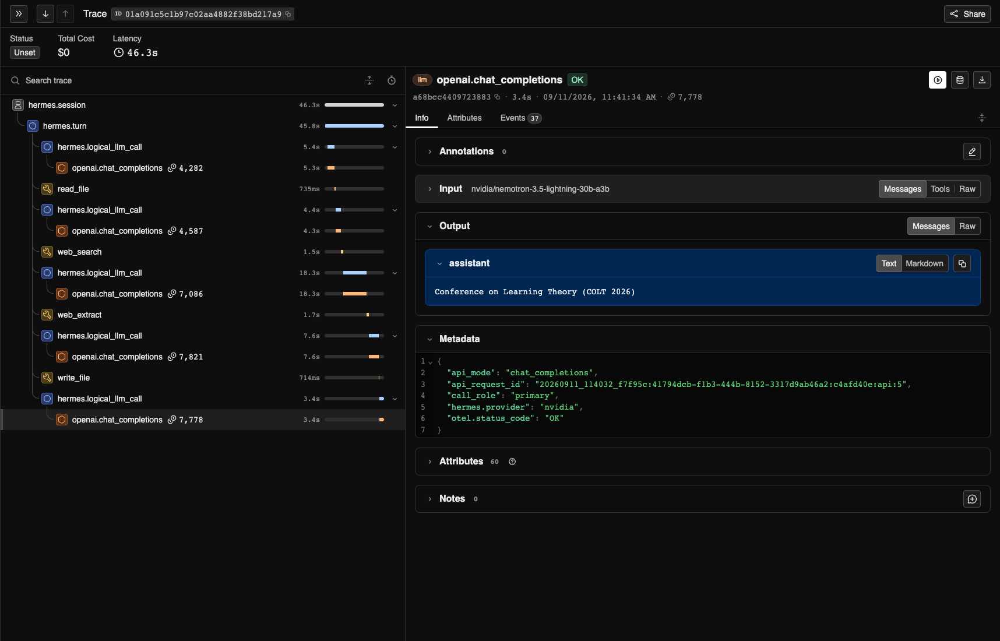

<!--
SPDX-FileCopyrightText: Copyright (c) 2026, NVIDIA CORPORATION & AFFILIATES. All rights reserved.
SPDX-License-Identifier: Apache-2.0
-->

# Trace and Evaluate Hermes Agent Runs with NeMo Relay

| Catalog field | Value |
| --- | --- |
| Description | Runs verified Hermes Agent tool-use tasks and produces NeMo Relay traces for local inspection and evaluation. |
| Industry | ✨ Other |
| Requirements | macOS or Linux · Git · curl · Docker · NVIDIA Build API key · internet access for the live research task |
| NemoClaw | N/A |
| Harness | Hermes 0.21.1 |
| OpenShell | N/A |

## Overview

An agent's final answer does not show every model call, tool call, retry, or
error that occurred during a run. An incorrect result can come from missing
context, a poor tool choice, or a failed call. Even a correct result can hide
repeated searches, unnecessary retries, and extra model calls. Tracing the run
helps you find these behaviors and understand their effect on reliability,
latency, and token usage.

[NVIDIA NeMo Relay](https://docs.nvidia.com/nemo/relay/latest/about-nemo-relay/overview)
gives agent developers a common way to observe and control model and tool
execution. [Hermes Agent](https://hermes-agent.nousresearch.com/) includes Relay
natively and maps its sessions, turns, model calls, and tool calls to Relay's
scope hierarchy. Relay records lifecycle events as that work begins and ends,
preserving timing and parent-child relationships.

**In this tutorial, you will:**

1. Set up an isolated environment for Hermes Agent and its built-in NeMo Relay
   integration.
2. Ask Hermes to run a small Python script, verify the expected result, and
   inspect the resulting Agent Trajectory Observability Format (ATOF) event
   stream and Agent Trajectory Interchange Format (ATIF) trajectory.
3. Ask Hermes to find a conference that fits a travel plan, save a verified
   report, and explore the run in [Arize Phoenix](https://arize.com/phoenix/).
4. Learn how to combine task verification with trace data when evaluating a
   controlled change to the prompt, tools, or agent harness.

## Screenshot



Phoenix displays the model and tool calls that produced a verified task result.
Select a span to inspect its timing, inputs, outputs, token usage, and errors.

## At A Glance

| Question | Answer |
| --- | --- |
| Category | Developer Tool |
| Contributor or provenance | NVIDIA |
| Use this when | You need to inspect Hermes Agent model and tool behavior or evaluate one controlled harness change. |
| You will get | A verified terminal-task result, local ATOF and ATIF files, and a Phoenix trace for the research task. |
| Runs on | macOS or Linux with Docker. |
| Requires | Git, curl, Docker, an NVIDIA Build API key, and internet access for the live research task. |
| Verified on | Not yet verified in NemoClaw Community. |
| Evidence level | local/static |
| Support and maturity | Best-effort community support. See [SUPPORT.md](../../../SUPPORT.md). |
| External access, data, and actions | Sends prompts to NVIDIA Build. Example 2 sends a public research query to web services, writes a report under `artifacts/`, and starts a local Phoenix container. |
| Start here | [Run Example 1](#quick-start). |
| Confirm success | [Verify Example 1](#verify-example-1). |

## Quick Start

Example 1 confirms that Hermes can call the model, run a terminal command in a
Docker sandbox, and create the ATOF and ATIF files. It is the recommended first
run because its result has an exact verifier.

### Set Up the Tutorial

Before you start, install [Git](https://git-scm.com/downloads),
[curl](https://curl.se/download.html), and
[Docker](https://docs.docker.com/get-started/get-docker/). Start Docker, then
generate an API key from the
[Nemotron 3.5 Lightning model page](https://build.nvidia.com/nvidia/nemotron-3.5-lightning-30b-a3b).

The setup script downloads a checksum-verified `uv` installer, checks out a
pinned Hermes Agent commit, and creates `.tutorial-runtime/` inside this
example directory. It does not modify an existing Hermes installation.

```bash
# Clone NemoClaw Community and enter this example.
git clone https://github.com/NVIDIA/nemoclaw-community.git
cd nemoclaw-community/examples/tools/hermes-relay-tracing

# Create the isolated Hermes Agent runtime.
./scripts/setup_tutorial_runtime.sh

# Create the local API-key file.
cp keys.env.example keys.env
```

Set your NVIDIA Build API key in `keys.env`. The file is ignored by Git.

```ini
NVIDIA_API_KEY=<your-nvidia-api-key>
```

### Example 1: Run and Trace a Terminal Task

Start with a small, predictable task to confirm that the setup works before
moving to the more realistic scenario in Example 2. The included
[`sample.py`](sample-project/sample.py) script contains one statement:
`print("VALUE=42")`. Hermes sends Nemotron 3.5 Lightning an instruction to run
that file. To complete the task, the model must request Hermes Agent's terminal
tool, which executes the script inside an isolated Docker container.

The runner checks that Hermes returns the exact output `VALUE=42`. A passing
run confirms that the model call, terminal-tool execution, Docker sandbox, and
Relay trace exporters all worked together.

The following commands contact NVIDIA Build. The terminal task runs in Docker
with no network access, no repository mount, and no API key passed to the
container.

```bash
# Confirm that Docker is running.
docker version

# Build the terminal-task image.
./scripts/build_tutorial_image.sh

# Run and trace the terminal task.
./scripts/run_tutorial.sh
```

## Verify Example 1

**Evidence level:** local/static

A successful run prints the following result and writes a run directory under
`artifacts/runs/`:

```text
ATOF summary:
completed llm scopes: <positive number>
llm scopes with usage: <positive number>
total tokens: <positive number>
tool calls: <positive number>
tool errors: 0

ATIF summary:
agent: Hermes Agent
model: nvidia/nemotron-3.5-lightning-30b-a3b
steps: <positive number>

Task verified: VALUE=42
Artifacts: .../artifacts/runs/<run-id>
```

**This verifies:** the pinned Hermes runtime can call the configured model,
execute the included script through the terminal tool, and export validated
ATOF and ATIF output.

**This does not verify:** that live web search is available or that a future
model, provider, or Hermes Agent release behaves the same way.

### Why the Task Runs in Docker

Hermes can execute terminal commands, so this tutorial runs them in an isolated
Docker container instead of on your host. The container cannot access the
network, repository checkout, or NVIDIA API key.

## Continue with Example 2

[tutorial.md](tutorial.md) explains the ATOF, ATIF, and OpenTelemetry outputs,
then walks through the live research task and its Phoenix trace. The task uses
public web search, so its sources and execution path can vary between runs.

## Cleanup

Example 1 leaves its generated traces in `artifacts/`. Example 2 starts a local
Phoenix container. Remove that container when you finish:

```bash
./scripts/stop_phoenix.sh
```

## Known Limitations

- Example 2 depends on live web search and an external conference website. It
  is useful for trace exploration, not for controlled benchmarking.
- The example is pinned to Hermes Agent `0.21.1` and the NeMo Relay version
  selected by that Hermes release. Run the documented verification after
  changing either dependency.
- Traces can contain prompts, model responses, tool inputs and outputs, and
  file paths. Review trace contents before sharing them.
