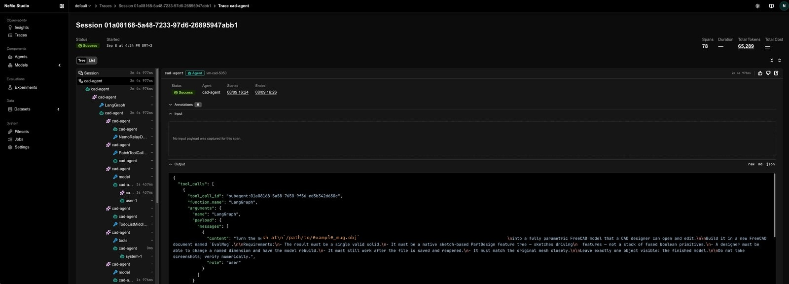
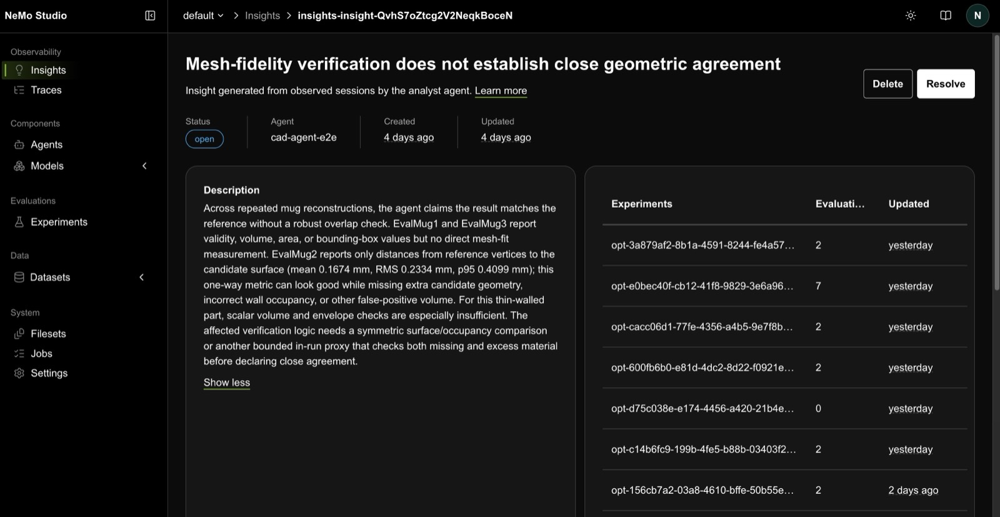

<!-- markdownlint-disable MD013 -->
<!-- SPDX-FileCopyrightText: Copyright (c) 2026 NVIDIA CORPORATION & AFFILIATES. All rights reserved. -->
<!-- SPDX-License-Identifier: Apache-2.0 -->
<!-- markdownlint-enable MD013 -->

# NeMo Platform Harness Optimization

| Catalog field | Value |
| --- | --- |
| Description | Deploys a CAD agent against a live desktop application, scores its output geometrically, turns its traces into Insights, and lets the platform author an eval and propose a fix against it. |
| Industry | 🏭 Manufacturing |
| Requirements | macOS · Python 3.12 or 3.13 · FreeCAD 1.1 with the MCP addon · NeMo Platform 0.5.0 on localhost · Docker for the verifier · a registered model provider |
| NemoClaw | N/A |
| Harness | LangChain Deep Agents 0.7.13 |
| OpenShell | N/A |

A worked, end-to-end loop for an agent that drives a real application: deploy it,
measure it against ground truth, find what it actually gets wrong, and let the
platform write the evaluation that detects that failure next time.

## Screenshot

[](assets/studio-trace.jpg)

One agent session in NeMo Studio. The span tree records every model call, tool
call and middleware step; the header carries the span count and token totals you
need for the cost side of any comparison. Telemetry is on in `agent/agent.yaml`,
so this appears without exporting anything or standing up a separate
observability stack.

Both screenshots come from an earlier run of this example, before the reference
mesh was renamed, so the prompt text in the trace shows the older filename. The
span tree, counts and Insight are otherwise what this walkthrough produces.

The out-of-loop scorer, run against the same document:

```text
$ python3 scorer/score.py EvalMug meshes/reference_mug.obj
0.3969
```

## At A Glance

| Question | Answer |
| --- | --- |
| Category | Developer Tool |
| Contributor or provenance | NVIDIA |
| Use this when | You have an agent driving an external application and you need a measured pass/fail rather than the agent's own report of success. |
| You will get | One IoU number per run, Insights filed from the traces, and an optimizer run that builds each candidate from its own `agent.yaml` and scores it against an eval suite the platform authored from an Insight. |
| Runs on | macOS with a FreeCAD GUI session on the same host. The agent runs on the host; only the verifier runs in a container. |
| Requires | FreeCAD 1.1 with the freecad-mcp addon, NeMo Platform 0.5.0, Docker, and a registered model provider. |
| Verified on | macOS 15, FreeCAD 1.1, NeMo Platform 0.5.0, deepagents 0.7.13, Python 3.13. |
| Evidence level | local/static for the bundled tests; live end-to-end for the published measurement runs. |
| Support and maturity | Best-effort community support. See [SUPPORT.md](../../../SUPPORT.md). The optimization agents move faster than the rest of the platform, so pin versions. |
| External access, data, and actions | Sends prompts and geometry descriptions to your configured inference endpoint. Mutates the FreeCAD document open on your screen. Runs a Docker container for the verifier. Writes telemetry to your local platform. |
| Start here | [Start Here](#start-here) |
| Confirm success | [Verification](#verification) |

## Why this exists

General-purpose coding assistants are strong at general software. They are much
weaker at engineering tasks that live inside a specific application, with a
specific data model and a specific notion of "correct."

Computer-aided design is a good example. Turning a scanned or exported mesh into
a **parametric CAD model** is not a text problem. The output has to be a real
feature tree of sketches, constraints and features that a designer can open and
edit. A model that looks right and is not editable is worthless, and a model with
the right volume can still be the wrong shape.

That is why specialised agents matter: they need the application's tools, and
they need a definition of success that is measured, not asserted.

This example is a minimal, reproducible loop on
[NVIDIA NeMo Platform](https://docs.nvidia.com/nemo-platform/documentation/home):

1. deploy a CAD agent that drives a real CAD application through MCP
2. define a **scorer** so "better" is a number, and an **Ethos** so the number is
   not the only thing that counts
3. run a **baseline** and collect traces
4. use **trace intelligence** to find what the agent actually gets wrong
5. hand the finding to the **Eval Author**, and let the platform write the
   evaluation that detects it next time
6. let the **Experimenter** propose a fix and score it against that evaluation

The point is not the mug. The point is that this is where you deploy an agent,
observe it, and then *evolve* it.

Two results up front, because they shaped everything else. The fix the platform
found on its own **more than doubled the deliverable** once it was deployed and
measured out of loop: median geometric accuracy went from 0.3969 to 0.9049
against the reference mesh. And an earlier candidate that *looked* like a win
improved its metric by 67% while making the mug worse. Telling those two apart needed a third artifact alongside
the scorer and the traces: a file that writes down what the agent is *for*.

That lesson returns in the last step, sharper. Once the platform starts writing
your evaluation criteria for you, the loop is no longer only optimizing against a
measurement; it is choosing what to measure.

## Prerequisites

- **Python 3.12 or 3.13.** NeMo Platform 0.5.0 declares
  `Requires-Python: >=3.12,<3.14`, so 3.11 and older and 3.14 and newer will
  not resolve. The install command below pins the interpreter so a newer
  system default cannot change which one the tool lands on. The offline test
  suite under `tests/` runs in a separate interpreter of your choosing and
  needs only Python 3.12 or newer; `requirements.txt` floors NumPy at 1.26,
  the first release with Python 3.12 wheels.
- **NeMo Platform 0.5.0**, installed pinned and with pre-releases allowed. The
  `[all]` extra depends on a pre-release adapter, and an unpinned install
  resolves backwards without saying so. See the install commands below.
- **FreeCAD 1.1+** with the [freecad-mcp](https://github.com/neka-nat/freecad-mcp)
  addon installed in your FreeCAD user `Mod/` directory and `auto_start_rpc`
  enabled. Launch the GUI normally: a FreeCAD started by executing the binary
  directly never attaches to the window server, so its RPC port answers while no
  queued work executes.
- **Docker**, for Steps 6 and 7. The evaluation suite's verifier runs in a
  container. The agent itself does not; see Step 6.
- **An inference provider** registered on the platform. Model entities are
  auto-discovered; list them with `nemo models list --all-pages` and substitute
  your own entity name into `agent/agent.yaml`.
- **No ambient Relay config.** If `~/.config/nemo-relay/plugins.toml` exists,
  every deployment fails at startup. Move it aside.

Install the platform:

```bash
uv tool install --python 3.13 --prerelease allow "nemo-platform[all]==0.5.0"
nemo --version     # confirm; a bad resolution looks like success
```

Then `nemo setup` to connect the platform, register an inference provider and
discover its models, and `nemo services run` to start it.

If you are working with a coding assistant, install the NeMo skills first. They
give it the platform's CLI conventions, which saves a lot of guessing at command
syntax:

```bash
nemo skills list
nemo skills install --agent claude     # also: codex, cursor, opencode
```

## Start Here

```bash
cd examples/tools/nemo-platform-harness-optimization
```

### Step 1: Define the agent

An agent on NeMo Platform is one declarative file, `agent/agent.yaml`:

```yaml
config_format: nemo-agents-spec-v1
name: cad-agent

instructions:
  system:
    content: |
      You are a CAD Agent (Computer Aided Design).

      A skills library is available at /skills/. Before starting a task, check
      whether a skill applies and read the applicable SKILL.md with read_file.

default_harness: deepagents

models:
  default:
    provider: nvidia
    model: REPLACE_WITH_YOUR_MODEL_NAME

mcp:
  servers:
    freecad:
      transport: stdio
      url: /opt/homebrew/bin/uvx
      args: [--from, freecad-mcp==0.1.24, freecad-mcp, --only-text-feedback]
      exposure: harness_native

environment:
  workspace: ./workspace
  artifacts: ./artifacts

telemetry:
  enabled: true
  provider: relay
  atif:
    enabled: true
    storage:
      - type: http
        endpoint: http://localhost:8080/apis/intake/v2/workspaces/default/ingest/atif
```

Three things matter here.

**`default_harness`** selects the agent runtime.
[NeMo Fabric](https://docs.nvidia.com/nemo/fabric/about-nemo-fabric/overview) is
the adapter layer underneath, so the same spec can target a different harness by
changing this one field. The model, tools, MCP servers, skills and telemetry are
declared once and reused. If none of the shipped harnesses fit, the
[adapter contract](https://docs.nvidia.com/nemo/fabric/adapter-contract/overview)
is a descriptor plus a small runtime that builds the agent however you want. You
keep the platform (Intake telemetry, Insights, evaluation, the deployment
lifecycle) and replace only the agent construction.

**The MCP server** connects the agent to a live FreeCAD session. `transport: stdio`
means `url` is the executable and `args` are its arguments. The agent gets tools
like `execute_code`, `create_object` and `list_documents`, and everything it does
appears in the FreeCAD window.

**`telemetry.enabled: true`** is what makes the rest of this possible. It streams
the agent's execution trace to **NeMo Intake** in ATIF format. Without it there
are no traces, and without traces there is nothing to analyse.

### Step 2: Deploy it

```bash
cd agent
nemo agents create --name cad-agent --agent-config "$PWD/agent.yaml"
nemo agents deploy --agent cad-agent --name cad-agent-deployment --mode subprocess
nemo agents invoke --agent-deployment cad-agent-deployment \
  --input "List the FreeCAD documents currently open."
cd ..
```

`--agent-config` must be an absolute path. Useful while iterating:

```bash
nemo agents list
nemo agents deployments list
nemo agents logs cad-agent-deployment -f
```

There is no in-place update. To ship a config change, undeploy, delete, then
create and deploy again. The platform serves the config captured at registration
time.

### Step 3: Start with the eval, not the agent

This is the step teams skip, and it is the one that makes everything after it
possible. **Before improving anything, define how you will know it improved.**

The task: turn a mesh into a parametric CAD model. The prompt states *what* is
required and never *how*. It ships at
`harness/dataset/train/parametric-mug/instruction.md`, with the mesh path left as
an `@MESH_PATH@` placeholder because it must be absolute for FreeCAD and an absolute
path cannot be committed. The harness wrapper resolves it at invoke time; the
command below substitutes it with `sed`.

```text
Turn the mesh at <mesh> into a fully parametric FreeCAD model that a CAD
designer can open and edit. Build it in a document named EvalMug.

- The result must be a single valid solid.
- It must be a native sketch-based PartDesign feature tree, with sketches
  driving features, not a stack of fused boolean primitives.
- A designer must be able to change a named dimension and have it rebuild.
- It must match the original mesh closely.

Leave the document open when you finish, with exactly one object visible.
```

The source is a 1,824-vertex coffee mug mesh, 15.50 x 10.33 x 13.44 mm.

#### The scorer

Geometry is scored by **IoU** (intersection over union) against the source mesh, the same metric the [BenchCAD](https://benchcad.com/leaderboard.html) leaderboard
uses for CAD geometry. A reference solid is built from the mesh, and the score is
the intersection volume divided by the union volume.

```bash
$ python3 scorer/score.py EvalMug meshes/reference_mug.obj
0.3969
```

This is deliberately minimal: one number, computed by per-XY-column Z-interval
ray casting, exact along Z and discretised at 0.1 mm in XY. That is enough to
make the loop work.

Volume alone is not a substitute. One run during development came within 3.7% of
the reference volume and scored **IoU 0.0**, because it had been built on the
wrong axis. Boolean intersection is not usable either: OCC returns an empty shape on
some perfectly valid candidates, and FreeCAD's mesh booleans crash the process on
the same inputs.

Keep the scorer **outside** the agent's directory, in `scorer/` rather than
`agent/`. Everything inside the agent directory is staged into the deployment and
readable by the agent's own file tools, and an agent that can read its grading
criteria will eventually optimize against them.

#### The Ethos: what the number is for

A scorer measures shape. It cannot say why shape matters, what you would trade
for it, or what would count as cheating. That belongs in an **Ethos**:
`agent/ETHOS.md`, a single Markdown file stating the agent's intent, uploaded
alongside the agent by `nemo agents create`.

It has a fixed schema, YAML front matter plus fifteen required sections, so
tooling can read it rather than guess. The sections that earn their keep here:

```markdown
## Success Criteria

- IoU >= 0.85 against the reference mesh.
- A native sketch-based PartDesign tree - sketches driving features - not a
  stack of fused boolean primitives.
- At least one named dimension whose change measurably moves the geometry.
  Verify by reading the volume back after setDatum + recompute; an unchanged
  volume means the dimension is not driving anything.

## Principles

- The feature tree is the deliverable. Shape accuracy is necessary but not
  sufficient; a designer must be able to edit the result.
- Trust the read-back, not the summary. Self-reported success is the least
  reliable signal available.

## Trade-offs

- Parametric quality over raw IoU. Given a choice between a boolean pile at
  0.95 and a sketch-driven tree at 0.88, the tree wins.

## Change Scope

- System prompt: yes
- Skills under `workspace/skills/`: yes
- Model selection: with-approval
- Eval task, reference mesh or scorer: no
```

Two of those lines do more work than they look. *The feature tree is the
deliverable* is the only place in the entire system that says a high score can
still be a bad result, and it is not hypothetical. One run here scored **0.903**
with 43 geometry elements under 43 `Block` constraints and zero named dimensions.
Shape-accurate, fully constrained, and uneditable.

And `Change Scope` is machine-readable (`yes` / `no` / `with-approval`), so an
automated optimizer can be told that the eval and the scorer are the measuring
instrument and never a valid target.

Validate it before relying on it, because the parser is strict:

```bash
python3 -c "
from nemo_agents_plugin.ethos_parse import parse_ethos
e = parse_ethos(open('agent/ETHOS.md').read(), strict=True)
print(len(e.sections), e.warnings, e.change_scope_levers)"
```

### Step 4: Run the baseline and look at the traces

> **This runs a live agent and spends tokens.** Prompts and geometry descriptions
> go to your configured inference endpoint, and the agent mutates the FreeCAD
> document open on your screen.

The gateway caps any single response at 300 s and returns `502` while the agent
keeps working, so raise it first:

```bash
export NEMO_AGENTS_GATEWAY_READ_TIMEOUT=1800
```

Run the task three times, into a different document each time:

```bash
for i in 1 2 3; do
  sed -e "s|@MESH_PATH@|$PWD/meshes/reference_mug.obj|" \
      -e "s/\`EvalMug\`/\`EvalMug$i\`/" \
      harness/dataset/train/parametric-mug/instruction.md > /tmp/prompt-$i.md
  nemo agents invoke --agent-deployment cad-agent-deployment \
    --timeout 1800 --input "$(cat /tmp/prompt-$i.md)"
  python3 scorer/score.py "EvalMug$i" meshes/reference_mug.obj
done
```

Run it three times, not once. Agent runs are noisy, and the next step needs more
than one trace to find a pattern. Ours took about three minutes each and every
one reported success.

The scorer disagreed: **0.3338, 0.3969 and 0.4323**, all well under the 0.85 the
Ethos asks for. The agent was confidently wrong, and only the measurement caught
it.

When a run 502s, recover duration and token counts from the trace rather than the
CLI, and do not score the document until the run has actually finished, or you
will grade a half-built model.

### Step 5: Trace intelligence

Now the interesting part. Instead of reading traces by hand, ask the platform to
analyse them:

```bash
export NEMO_DEFAULT_MODEL="default/<your-model>"
export NEMO_FAST_MODEL="default/<your-fast-model>"

nemo agents analyst run --agent cad-agent --ethos agent/ETHOS.md
```

The analyst reads the traces from Intake directly: no separate harness, no
containers, no exported files. It surveys spans, clusters similar failures across
sessions, and emits **Insights**: persistent entities with a title, an actionable
description, and the trace references that evidence them.

`--ethos` is optional and takes a path. Supply it and the analyst judges the
traces against your success criteria; leave it out and it infers a standard of
its own, which is usually reasonable and not necessarily yours. On the traces
behind this example the same command filed **0 Insights without it and 2 with
it**.

One behaviour to know before Step 6 introduces a profile: if the analyst
discovers an `optimizer.yaml` by walking up from the working directory, it writes
Insights to `.nemo-optimizer/insights.yaml` **instead of** the platform, and they
will not appear in Studio. Run it from the example root, above `harness/`.

You can also opt the agent into periodic analysis and let a platform controller
do it on a schedule:

```bash
nemo insights analysis enable --agent cad-agent
nemo insights analysis status
```

From three traces, and nothing else on a platform with no other history, it
produced **two** Insights, each citing all three runs:

> **1. Mesh fidelity is claimed from bounding boxes and volume without
> validating shape overlap**
>
> *"…it never performs an overlap, sampled-distance, or comparable geometry
> check before claiming the model matches closely… across the same mug input,
> the three runs produced different feature strategies and final volumes of
> about 306.5, 359.2, and 274.5 mm³ against a 382.1 mm³ reference, while every
> run reported success."*

> **2. FreeCAD reconstruction becomes a long trial-and-error loop with repeated
> API failures**
>
> *"…12 to 18 FreeCAD tool invocations rather than a few bounded
> construction/verification calls, and each run contains multiple failed
> `execute_code` attempts… Because each model turn replays the growing tool
> history, later calls carry very large contexts while debugging transient API
> mistakes."*

Two defects, two different kinds. The first is about **correctness**: the agent
has no way to check its own work. The second is about **process**: it gets there
by trial and error.

[](assets/studio-insight.jpg)

Two things are worth noticing. The scorer independently agrees with the first
Insight, and the analyst cites *"the 0.85 success criterion"*, a number that
appears nowhere except your `ETHOS.md`.

List what it filed:

```bash
curl -s http://localhost:8080/apis/insights/v2/workspaces/default/insights
```

#### From Insight to fix

You could stop here and fix it by hand: give the Insight and its linked traces to
a coding agent, and have it write a skill telling the agent to measure before
declaring success. That works, and it is where most teams stop.

But it does not scale, and it leaves the same gap open. A hand-written fix is
still unmeasured: nothing in the harness detects this failure the *next* time it
appears, so the next regression needs the same manual round trip.

The rest of this closes that loop instead. The platform will write the evaluation
that detects the Insight, propose a fix against it, and score that fix on a
split it could not read while the candidates were being written.

### Step 6: Turn the Insight into an eval

Step 5 told us what is wrong. Nothing in the harness *measures* it: the scorer
measures shape, while the Insight is about whether the agent verifies its own
work. Run any optimizer now and it would chase IoU and learn nothing about the
defect it diagnosed.

NeMo Platform closes that gap with two more agents that work on the same Insight
entity:

| Agent | Takes | Produces |
| :---- | :---- | :---- |
| **Analyst** | Traces in Intake | Insights |
| **Eval Author** | One Insight + its traces | An eval suite that detects it |
| **Experimenter** | One Insight + that suite | A scored candidate |

The Eval Author has no command of its own. It runs as the first phase of
`nemo agents experimentalist`. What it needs from you is an evaluation the
platform can execute, as [Harbor](https://www.harborframework.com/) tasks. That
is what `harness/` is:

```text
harness/
  optimizer.yaml          # the shared profile
  experiment-config.yaml  # bounds on the search
  agent_source/           # what the loop may change
    harbor_wrapper.py     # how Harbor runs your agent
  task-template/          # one task with placeholders, filled from traces
  dataset/train/          # tasks to optimize against
  dataset/validation/     # tasks to score against, hidden during generation
```

A Harbor task is four files: `task.toml`, `instruction.md`, an `environment/`
container definition, and `tests/test.sh`. The three `tests/` directories are
byte-identical copies on purpose, because Harbor requires each task directory to
be self-contained.

Your agent drives a desktop application, which looks like a blocker: you cannot
put a live FreeCAD session in a container. You do not have to. Harbor runs the
agent on the **host** and uses the container only for the verifier, so the task
environment needs Python, not FreeCAD:

```toml
[environment]
image = "python:3.12-slim"    # verifier only; the agent runs on your machine
```

Harbor reaches your agent through one class you write,
`harbor_wrapper:WrappedAgent`. Nothing ships a default. This one builds the
agent from `agent.yaml` in its own directory, waits for the trace to reach
Intake, converts it to the OTLP the verifier reads, and scores the result
against the reference mesh.

Building from the candidate's own config is what makes the loop meaningful.
Every candidate is a full copy of `agent_source/`, so a candidate can change the
model, the system prompt, the MCP server set, or add a skill under
`workspace/skills/`, and the next trial measures that change rather than a proxy
for it. The config needs `api_key_env` and `base_url` under `models.default`,
which the deepagents adapter requires when the agent is built from a file.

The profile, `harness/optimizer.yaml`, points at all of it:

```yaml
agent: cad-agent
ethos: ../agent/ETHOS.md
workspace: default

agent_source: ./agent_source
task_template: ./task-template
datasets:
  train: ./dataset/train
  validation: ./dataset/validation
```

`agent_source` is not optional: the Insight names a *registered* agent, which the
loop cannot edit, so it needs a directory or a git URL. Only a git source can
open a pull request for the winner.

Check the whole chain before spending anything:

```bash
cd harness
nemo agents experimentalist doctor --insight <insight-id>
```

```text
Agent-source  ✓ evaluator entrypoint harbor_wrapper:WrappedAgent
Artifacts     ✓ task_template  ✓ train dataset  ✓ validation dataset
Models        ✓ default=<your-model>; fast=<your-fast-model>
Platform      ✓ http://localhost:8080 reachable   ✓ insight verified
Runtime       ✓ docker daemon running             ✓ harbor importable
```

One setting is not optional. Concurrency defaults to your CPU count, but a live
FreeCAD session is a single shared resource, so trials must be serial. The same
file bounds the run. The defaults, 15 rounds of 3 candidates, are far too large
when every trial is a full reconstruction. `harness/experiment-config.yaml`:

```yaml
max_rounds: 1
max_candidates: 2
max_survivors: 3
min_rounds_before_stopping: 1
outcome_evaluator_config:
  n_concurrent_trials: 1  # a live FreeCAD session is one shared resource
  n_attempts: 2           # measure every task twice; the default is 1
storage:
  publish_winner: false   # defaults to true
  archive_candidates: false
regression_metrics:
  - name: eval_iou
    direction: maximize
```

`n_attempts` matters as much as the bounds. Agent runs are noisy, and a single
trial per task cannot separate a real improvement from run-to-run variance.

**`regression_metrics` is the part that keeps the loop honest, and it is on from
the first run.** The Eval Author writes the objective, and its metric asks
whether the agent measured its own output and acted on the result. That is the
right question for the Insight and the wrong question for the product: a
candidate can score 1.000 on it while building a worse mug. That is not
hypothetical. An earlier run of this example produced a winner whose authored
metric rose 67% while IoU fell from 0.6207 to 0.5442.

So the deliverable goes in as a floor rather than as a second objective.
`eval_iou` is the out-of-loop geometric score, measured on the host by the
wrapper and published into the trace as a span the containerised verifier reads
back. The selector treats the two lists differently: objectives are *ranked*,
while a candidate that worsens a regression metric against the baseline is
**dropped before ranking**. A gain on the authored metric cannot pay for a loss
on geometry.

It is also the only list that cannot be inflated. Adding objectives widens the
Pareto front and makes selection noisier, because with several noisy objectives
estimated at `n_attempts: 2` almost everything is non-dominated by chance.
Adding a guardrail only ever removes candidates.

That holds only if a candidate cannot rewrite the guardrail. The optimizer
copies `agent_source/` into every candidate and invites a coding agent to edit
it, so the metric lives in `scorer/trial_metric.py`, outside that directory, and
the wrapper loads it from the example root and refuses to run if it ever
resolves inside the candidate. The scorer it calls is outside for the same
reason: anything inside the agent directory is readable, and now writable, by
the thing being measured.

The cost is getting ground truth into the loop at all: the verifier runs in a
container and can never open FreeCAD, so IoU has to be measured host-side and
carried in through the trace. That is the one piece of real work in
`harbor_wrapper.py`, and it is what turns the loop from optimizing a proxy into
optimizing a proxy that is not allowed to break the product.

### Step 7: Let the platform fix it

```bash
nemo agents experimentalist run \
  --insight <insight-id> \
  --task-template ./task-template \
  --config experiment-config.yaml \
  -o ./experiment
cd ..
```

**`--config` is load-bearing.** `experiment-config.yaml` does not take effect by
existing; without that flag you get the defaults.

The run builds a baseline, analyses the Insight's root cause, proposes candidate
changes, has a coding agent implement each one, and scores them on the validation
split. That split is physically moved out of reach during candidate generation
and restored only for scoring, so the agent writing the candidates never reads
it. The isolation is in the mechanism, not in the content: this example's
validation task is the training task with a different document name, so a
validation score here measures repeatability on the same part, not
generalization to a new one. Point it at a different mesh with different
requirements if you want the second thing.

#### What it proposed

The strongest candidate wrote a **policy document**: a Markdown skill stating how
the agent must verify its own geometry, and wired it into what the agent
receives.

```text
agents/agent-1/
  workspace/skills/geometry-fidelity-policy/SKILL.md      ← new
```

That is the same artifact a human would reach for, arrived at from nothing but
traces and an Insight. The one this run produced is recorded at
[`results/geometry-fidelity-policy/SKILL.md`](results/geometry-fidelity-policy/SKILL.md)
so you can compare it with what your own run writes. It is deliberately **not**
preloaded into `agent/workspace/`: the agent you deploy in Step 2 is the naive
one, and the skill only arrives if the loop produces it.

It turns the Insight into a rule:

> *"Structural and persistence evidence cannot substitute for geometric-fidelity
> evidence. Matching a bounding box or a few global dimensions is also not
> sufficient… because materially different surfaces can share those properties."*

Declare the tolerance **before** measuring, then produce **bidirectional**
evidence: either surface distances reported in both directions with a worst-case
statistic, or a registered volumetric overlap that penalises both material the
candidate adds and material it is missing:

> *"A one-way nearest-distance result is insufficient: it can hide missing source
> features or unsupported extra candidate geometry."*

Notice what that overlap option is. A registered volumetric measure penalising
both extra and missing material is *exactly* the IoU the scorer computes in Step
3, which the optimizer cannot see. Working only from traces, it reinvented the
external measurement.

#### The result

```text
Finished · winner=agent-1 · validation symmetric_material_overlap 0.664
report:  ./experiment/eval-and-optimize/OPTIMIZATION.md
```

`OPTIMIZATION.md` carries the per-round reward tables, the root-cause analysis
for each round, and the full source of every candidate under `agents/agent-N/`.

One complete run is recorded in
[results/optimization-run.md](results/optimization-run.md). The candidate worth
reading twice is the one that changed only the system prompt in its
`agent.yaml` and scored 0.402 against a 0.514 baseline. A system prompt is
measurable at all only because each trial builds the agent from the candidate's
own config, and what it measured was that the proposal made the result worse.

**Only promotable changes are measurable.** Each candidate is a full copy of
`agent_source/`, and the wrapper builds the agent from the copy's own
`agent.yaml`. Three things there are worth optimizing and can all be shipped by
copying the file and the workspace: the **system prompt**, **subagents**, and
**skills** under `workspace/skills/`. Everything else is pinned by
`_assert_promotable_change_surface` and checked before any trial runs:

| Pinned | Why |
| --- | --- |
| `harbor_wrapper.py` | the harness runs trials; it is not part of the agent |
| every other `agent.yaml` block | the model and its sampling parameters are a deployment decision, not agent design |

That check is not theoretical. In the first recorded run the winning candidate
edited the wrapper to add its own measurement step, and the traces show the
result never reached the model: the reward moved for a change that could not be
shipped. Advice was not enough, and the optimizer's coder is already advised
that harness files are out of scope. Now a candidate that touches a pinned
surface raises at import, produces no metric, and cannot reach the Pareto
front, so a reward difference is always attributable to something you can
deploy.

Pinning the model matters as much as pinning the harness. Left open, the loop
answers "which model is stronger" instead of "which prompt works better", and
only one of those is a finding about your agent.

Middleware and pre- or post-model hooks are absent from the change surface
because they are unreachable, not because they are forbidden: the deepagents
adapter accepts only `subagents` and `interrupt_on` under `harnesses`, and owns
`model`, `tools`, `backend`, `skills`, `system_prompt`, `middleware` and
`checkpointer` itself. A hook cannot be expressed in `agent.yaml`, so no
candidate could promote one. Reaching that surface means writing a Fabric
adapter, which is a different project.

Before believing any winner, apply two external checks. **Did the candidate
actually use what it changed?** One winner here wrote a 168-line surface-distance
MCP server and never called it. It had added the server but left the system
prompt untouched. **And what does the out-of-loop scorer say?** On that same run
the authored metric rose 67% while IoU fell from 0.6207 to 0.5442.

### Step 8: The optimizer is not a prompt-tweaker

Step 5 produced two Insights. This walkthrough optimizes against the first. The
second, *"FreeCAD reconstruction becomes a long trial-and-error loop"*, is a
different kind of problem: process rather than correctness.

Running the same loop against it is worth doing for one observation. Across both
Insights the optimizer proposed changes at **every level of the agent**, not just
its prompt:

| Level | What a candidate actually wrote |
| :---- | :---- |
| **Skill** | `geometry-fidelity-policy/SKILL.md`, an acceptance policy |
| **MCP tool** | a server exposing live FreeCAD API signatures so the agent stops guessing interfaces |
| **MCP tool** | bidirectional surface distance via trimesh, with worst-error clustering |
| **System prompt** | a phase gate with an explicit tool-call budget and a forced discovery→construction transition |
| **Subagents** | a planner/builder split, declared through `deepagents.subagents` |
| **Agent code** | an execution governor and a resilient MCP wrapper classifying every call as success, recoverable, or terminal |

That range is the point. A coding agent with the Insight, the traces, and write
access to the agent's source will reach for whatever surface fits the diagnosis:
a new tool when the agent lacks a capability, a policy document when it lacks a
standard, a prompt constraint when it lacks discipline. None of these were
suggested to it.

Every row above is a surface the trial actually runs, because the candidate's
own `agent.yaml` and `workspace/` are what the wrapper builds the agent from.
Step 9 then re-measures the winner on the deployed agent, which is a different
environment rather than a different change.

The second Insight is left open here. Its candidates improved the metrics they
were given, but an end-to-end win on the deliverable could not be demonstrated
within this experiment, and the honest thing is to say so rather than promote a
change that cannot be stood behind.

### Step 9: Promote the fix, then measure what you shipped

A skill reaches the agent through `environment.workspace` on a *deployed* config,
which is exactly the surface the trials could not exercise. So promoting is not
the end of the validation; it is the start of it.

```bash
mkdir -p agent/workspace/skills
cp -r harness/experiment/eval-and-optimize/agents/agent-1/workspace/skills/geometry-fidelity-policy \
      agent/workspace/skills/
# or, to reproduce the published measurement with the skill this run produced:
#   cp -r results/geometry-fidelity-policy agent/workspace/skills/

nemo agents undeploy --agent cad-agent --yes
nemo agents delete cad-agent --yes
cd agent
nemo agents create --name cad-agent --agent-config "$PWD/agent.yaml"
nemo agents deploy --agent cad-agent --name cad-agent-deployment --mode subprocess
cd ..
```

Then repeat Step 4 and compare against your baseline:

| Statistic | Naive | With the fidelity policy |
| --- | ---: | ---: |
| Median IoU | 0.3969 | **0.9049** |
| Runs ≥ 0.85 | 0 of 3 | **2 of 3** |
| Median spans | 146 | 167 |
| Median total tokens | 201,650 | 300,485 |
| Median latency | 203 s | 250 s |

The policy costs roughly 50% more tokens and 25% more latency, because it makes
the agent measure its output against the source geometry and iterate instead of
building once and declaring success. You are paying for the iterations.

The distribution matters as much as the median. The policy arm scored 0.0421,
0.9049 and 0.9092, a mean of 0.619, and no run landed anywhere near 0.619. An
early decision about the feature tree either works or cannot be repaired.
**Report the median and the fraction of runs clearing your bar, not the mean.**
Full records and their limits are in [results/README.md](results/README.md).

Mark the Insight resolved only once the redeployed agent clears the bar on a
measurement you ran yourself:

```bash
curl -s -X PATCH \
  http://localhost:8080/apis/insights/v2/workspaces/default/insights/<id> \
  -H 'Content-Type: application/json' -d '{"status":"resolved"}'
```

## What this loop actually is

Nothing here is CAD-specific:

1. **Deploy** the agent with telemetry on.
2. **Define a scorer**: one number, measured, not asserted.
3. **Write an Ethos**: what the number is for, and what you will not trade for it.
4. **Run a baseline** several times and collect traces.
5. **Analyse the traces** to find what is actually wrong. *(Analyst)*
6. **Author an eval for what you found**, so the next iteration can see it. *(Eval Author)*
7. **Propose and score a fix** against that eval. *(Experimenter)*
8. **Deploy the winner and re-measure**, because a trial builds the agent
   from a config file while production serves a registered deployment.

Steps 5 to 7 are the ones the platform automates, and step 6 is what makes it a
loop rather than a single repair. A scorer written up front can only measure the
failures you anticipated; the analyst finds the ones you did not. Until something
turns those into a measurement, every discovery is a one-off fix.

What does not automate is judgment, and the loop's own numbers will not supply
it. Across these runs:

- The scorer said **IoU 0.6207** while the agent reported success. Re-measured at
  n=3, the same agent scored **0.334 to 0.432**; the first number was a lucky draw.
- The authored metric grades whether the agent *checks its work*, not whether
  the mug is right, and that gap is exactly the room a candidate has to win the
  metric while losing the product. In the recorded run the two happened to
  coincide, which is luck, not design.
- The winner that did hold up cost **50% more tokens** than the naive agent. Read
  in isolation, that is a regression.

Every one of those numbers is real and correctly measured. The conclusion each
invited on its own was wrong, because each answered a narrower question than the
one that mattered.

The lesson is not to distrust the loop. It is to **put the thing you actually
care about inside it**, and to measure it more than once. A proxy makes a fine
objective; it makes a terrible sole criterion. That is why `eval_iou` is a
guardrail in Step 6 rather than an afterthought here.

**An optimization loop improves whatever it can measure.** Automating the writing
of evals does not repeal that; it raises the stakes, because now the loop also
chooses what to measure. Which is why the scorer and the Ethos stay outside the
loop, as the things it answers to rather than things it can edit.

## Credentials and environment

Copy `.env.example` to `.env`, which is git-ignored. The example file names every
variable and carries no values.

| Variable | Default | What it does |
| --- | --- | --- |
| `NEMO_DEFAULT_MODEL` | none | Workspace-qualified model for the analyst and optimizer. Required. |
| `NEMO_FAST_MODEL` | none | Workspace-qualified fast model. Required. |
| `NMP_BASE_URL` | `http://localhost:8080` | The local platform. |
| `NMP_WORKSPACE` | `default` | Workspace the agent is registered in. |
| `NEMO_AGENTS_GATEWAY_READ_TIMEOUT` | `300` | Raise it. The gateway caps any response at 300 s and returns 502 while the agent keeps working. |
| `FREECAD_RPC` | `http://127.0.0.1:9875` | The MCP addon's RPC endpoint. |
| `FREECAD_BIN` | platform default | FreeCAD binary used for headless scoring. |
| `CAD_SCORER` | `scorer/score.py` | Absolute path to the scorer. |
| `CAD_AGENT_TIMEOUT` | `3600` | Seconds to wait for one invocation. |
| `CAD_AGENT_TRACE_WAIT` | `3600` | Seconds to wait for the trace to reach Intake, which ingests asynchronously. |

No API key belongs in `agent.yaml`. Platform-routed models take their credential
from the gateway, and the runner injects it into the deployment process.

## Troubleshooting

| Symptom | Cause | Fix |
| --- | --- | --- |
| `502 Bad Gateway`, but the deployment logged `200` | The gateway caps a response at 300 s while the agent keeps building. | Raise `NEMO_AGENTS_GATEWAY_READ_TIMEOUT`. Recover tokens and latency from the trace, not the client. |
| Every deployment fails at startup | An ambient `~/.config/nemo-relay/plugins.toml`. | Move it aside; select Relay configs with `HERMES_NEMO_RELAY_PLUGINS_TOML`. |
| `agents create` fails with `File exists: .../-ethos-upload-` | `--agent-config` was a relative path. | Pass an absolute path. |
| Config edits change nothing | There is no update command; the platform serves the config captured at registration. | Undeploy, delete, create and deploy again, as in Step 9. |
| Scorer raises `ConnectionRefusedError` | FreeCAD went down. The score is void, not zero. | Probe port 9875, relaunch the GUI, discard the run. |
| RPC port listens but nothing executes | FreeCAD was started by running the binary directly, so it never attached to the window server. | Quit it and launch the GUI normally. |
| A metric scores 0.000 for a tool the agent called, or counts are inflated ~70x | Intake nests MCP calls inside LangGraph node spans, and every model turn replays the whole tool history. | Walk span payloads for `{"type": "tool_call"}` and de-duplicate on `call["id"]`, not on position. |
| Analyst finds nothing and Studio shows no Insights | A discovered `optimizer.yaml` redirected them to `.nemo-optimizer/insights.yaml`. | Run the analyst from the example root, above `harness/`. |
| Optimizer used the defaults you thought you overrode | `experiment-config.yaml` takes effect only when passed with `--config`. | Pass `--config experiment-config.yaml` explicitly. |
| The skill never appears in the system prompt | `skills.paths` is not the loading mechanism here. | Keep the skill under `agent/workspace/skills/` and the pointer in the system prompt. |

## Known limitations

- **A trial runs the agent from a config file, production serves a deployment.**
  `harbor_wrapper.py` builds each candidate from its own `agent.yaml`, so the
  change surface is real, but a trial and a deployed run are not byte-identical
  environments: a trial needs `api_key_env` and `base_url` in the config, and it
  does not pass through the gateway. Step 9 re-measures on the deployment for
  that reason.
- **The validation split is the training task under a different document name.**
  The `.aad-heldout/` mechanism that hides it during candidate generation is
  real, but the mesh and the requirements are identical, so a validation score
  here reports repeatability rather than generalization.
- **Non-determinism here is branch divergence, not sampling noise**, and the
  sampling surface is one knob: `temperature`. `models.default.settings` is never
  read on the deepagents path, so a `seed` placed there is inert, and there is no
  `seed` or `top_p` in the agent spec at all.
- **The sample sizes needed for statistical confidence do not fit the budget.**
  Detecting a 0.10 difference at the observed spread needs roughly 35 runs per
  arm. Use the optimizer to generate hypotheses and score winners out of loop.
- **macOS only, as verified.** Nothing here is inherently macOS-specific except
  the FreeCAD paths, but no other platform was tested.
- **The Eval Author is non-deterministic.** The same Insight produced three
  differently-named metrics across three runs. Re-authoring is a re-baselining
  event; freeze the suite and use `--no-insight` for comparable runs.

## Verification

**Evidence level:** local/static

```bash
cd examples/tools/nemo-platform-harness-optimization
python3 -m pip install -r requirements.txt
python3 -m unittest discover -s tests
```

**Expected result:**

```text
Ran 69 tests

OK
```

**This verifies:** the interval arithmetic and ray-casting core of the scorer
against hand-computed values, and the trace-conversion logic in the harness
wrapper, including the tool-call de-duplication that collapses 153 replayed
mentions back to 17 real calls.

**This does not verify:** the live FreeCAD export path, the deployed agent, the
analyst, the optimizer loop, or any behaviour on a platform other than macOS.
Those require the credentialed end-to-end path above.

## Teardown

```bash
nemo agents undeploy --agent cad-agent --yes
nemo agents delete cad-agent --yes
```

Close any `Eval*` documents left open in FreeCAD. Optimizer output under
`harness/experiment/` is run output and is git-ignored; delete it freely.

## Provenance and license

Contributed by NVIDIA under the repository's
[Apache-2.0 license](../../../LICENSE). The `freecad-mcp` server is invoked
through `uvx` and is not vendored here.
